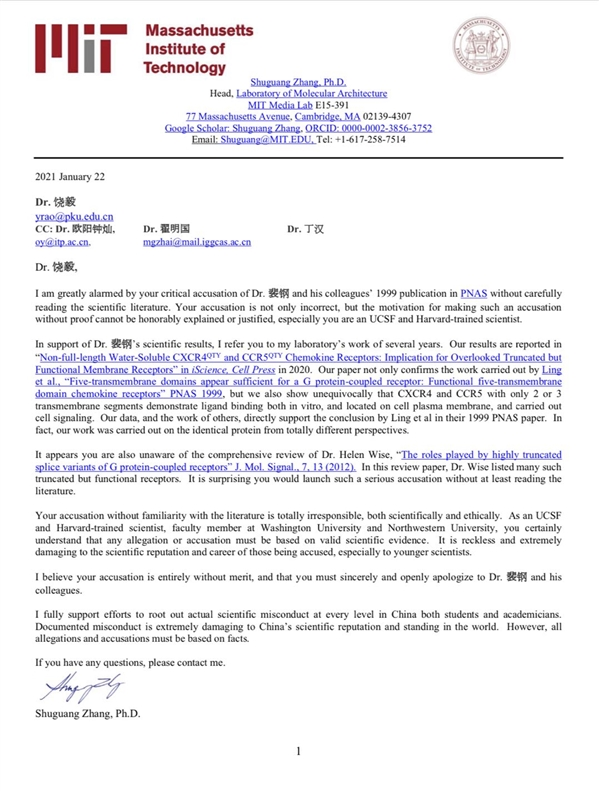
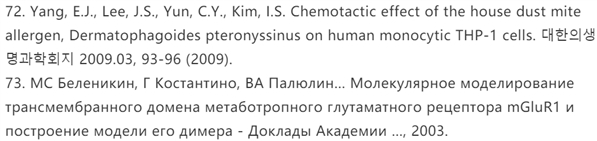
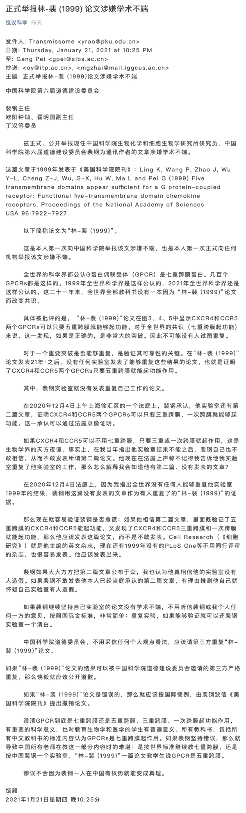
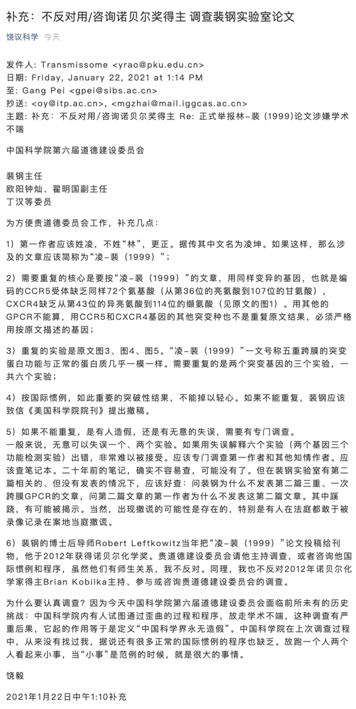

 ##  张曙光VS饶毅：关于裴钢被质疑论文的争鸣

[张曙光VS饶毅：关于裴钢被质疑论文的争鸣—新闻—科学网 (sciencenet.cn)](http://news.sciencenet.cn/htmlnews/2021/1/452248.shtm)

**编 者 按**

1月22日，美国麻省理工学院分子结构实验室（Laboratory of Molecular Architecture）首席研究员（Head）张曙光向科学网提供了一份当天致饶毅教授的信件，就后者21日晚在其个人公号“饶议科学”上“正式举报林-裴(1999)论文涉嫌学术不端”一文发表看法。

此外，受质疑论文的3位第一作者（通讯作者为裴钢院士）向科学网提供了和这篇论文相关的综述材料。

学术争鸣在科学发展过程中具有举足轻重的作用。作为“全球华人科学家社区”，科学网特发布各方观点，希望能促进彼此间的理性对话，弘扬好“追求真理、严谨治学”的求实精神。

**1. 张曙光致饶毅信件全文**

饶毅博士：

我对您针对裴钢博士及其同事1999年在PNAS上发表的论文提出指控却没有认真阅读相关科学文献感到非常震惊。作为一名在加州大学旧金山分校和哈佛大学受过正规科研训练的科学家，您的指控不仅是错误的，而且也没有对进行指控的动机进行解释或证明。

为了支持裴钢博士的科学科研成果，请您参考近几年我在麻省理工学院的研究成果工作。我们的研究结果已经以“Non-full-length Water-Soluble CXCR4QTY and CCR5QTY Chemokine Receptors: Implication for Overlooked Truncated but Functional Membrane Receptors” 为题，2020年报道发表在Cell子刊iScience(Cell Press)上。我们的论文不仅证实了凌堃等人1999年报道在PNAS 上的“Five-transmembrane domains appear sufficient for a G protein-coupled receptor: Functional five-transmembrane domain chemokine receptors”工作中报告的结果，也明确地表明，只有2个或3个跨膜片段的CXCR4和CCR5突变体能够显示出配体结合活性、能够定位到细胞质膜上、并能够进行细胞信号转导。我们的数据以及其他人研究组的工作都直接支持了凌堃等人在其1999年PNAS论文中的结论。实际上，我们的研究工作完全是从迥异的研究角度对相同的蛋白质进行的。

看来您也没有关注到Helen Wise博士的综述论文，“ G蛋白偶联受体的高度截短的剪接变体所起的作用”。J. Mol. Signal., 7, 13 (2012)。在这篇综述文章中，Wise博士列出了许多此类截短但具有功能正常的受体。令人惊讶的是，您竟然可以在完全不阅读文献的情况下提出了如此严重的指控。

您在不熟悉相关科学文献的情况下提出的指控，在科学和伦理上都是完全不负责任的。作为在加州大学旧金山分校和哈佛大学受过训练的科学家、华盛顿大学和西北大学的教授，您理应知道，任何指控都必须基于有效的科学证据。您鲁莽的指控，对于被指控者，尤其是年轻科学家的科学声誉和科研生涯造成极大损害。

我认为您的指责完全没有道理，您必须真诚地向裴钢博士及其同事道歉。

有据可查的科研不当行为严重损害了中国的科学声誉和世界地位，但是，所有指控和指控都必须基于事实。我全力支持在中国各个层面将学生和院士的科研不当行为斩草除根。

如果您有任何疑问，请联系我。

张曙光博士

\2. 受质疑论文3位一作提供的关于1999年论文相关综述材料

**关于G蛋白偶联截短受体的国内外研究进展报告**

凌堃（梅奥医学中心生化与分子生物学系 副教授）、

赵简（上海科技大学免疫化学研究所 研究员）、

王平（同济大学医学院 教授）

在动物细胞膜上表达的各种信号受体中，G蛋白偶联受体（GPCR）家族可以说是成员最为众多，功能最为多样，分布最为广泛的家族。目前已确认的人类GPCR有1265个，单个细胞类型通常表达一百种以上的GPCR，这些信号受体通过激活细胞中的各种G蛋白，影响着目前已知的人类生理病理的所有方面；相应的，至少有50％的上市药物靶标是GPCR家族成员。

以往大家通常认为，7次跨膜结构对GPCR来说是一种普遍适用的结构，可能最有利于G蛋白和下游信号的激活。然而自90年代初起，历年来的研究揭示了一些特例，提示少于7次跨膜的某些GPCR家族成员的变体和某些非7次跨膜结构的受体，也具备不同程度的GPCR功能。

其中，我们1999年发表在PNAS的研究使用GPCR家族成员CCR5和CXCR4作为模型，提供了较早的证据（Ling K, Wang P, Zhao J, Wu YL, Cheng ZJ, Wu GX, Hu W, Ma L, Pei G. Five-transmembrane domains appear sufficient for a G protein-coupled receptor: functional five-transmembrane domain chemokine receptors. Proc Natl Acad Sci U S A. 1999; 96:7922-7）。

在我们的研究发表之后，更多类似的特例被陆续发现，包括一些GPCR经过转录剪切而产生的天然跨膜区缺失变体（包括5次跨膜及其他类型的跨膜区缺失），为研究GPCR结构功能而人为制作的跨膜区缺失变体， 以及一些非7次跨膜的其他种类的膜受体，这些非典型的GPCR受体仍能介导G蛋白下游信号。

这些结果表明，各个跨膜区的重要性在不同的GPCR中可以有很大的差异，5次跨膜或其他少于7次跨膜的GPCR可以通过形成同源或异源多聚体的方式，至少部分行使结合配体并激活下游G蛋白信号的功能。

这些研究显示，特定GPCR家族成员具有不同于普适规律的个性，揭示了细胞调节G蛋白信号的新颖方式，有助于我们理解复杂的细胞生理病理的分子机制，制定与之对应的特异的干预办法，为药物研发等提示新的思路。

**（一）天然存在的GPCR 少于7次跨膜截短变体**

\1. G蛋白偶联受体bacteriorhodopsin存在缺失第1和第2跨膜区的5次跨膜天然变体，这个5跨膜变体在体外系统中也可以表达在细胞膜上。（Theodore WK and Donald ME. Bacteriorhodopsin Can Be Refolded from Two Independently Stable Transmembrane Helices and the Complementary Five-Helix Fragment. Biochemistry. 1992; 31:6144-51.）

\2. G蛋白偶联受体mGluR1需要形成二聚体来激活G蛋白信号通路。有趣的是，这个研究表明，缺失第1和第2. 跨膜区不影响这种二聚体的形成。（Belenikin MS, Costantino G, Palyulin VA, Pellicciari R, Zefirov NS. Molecular modeling of the mGluR1 metabotropic glutamate receptor transmembrane domain and construction of the model of its dimer. Dokl. Biochem. Biophys. 2003; 393:341-5.）

\3. 编码GnRH-II受体的基因除表达野生型7次跨膜受体外，也可以产生5次跨膜的天然截短变体。这一5跨膜GnRH-II受体缺失第1和第2跨膜区，但仍能响应配体的特异性刺激，发挥受体功能。（Neill JD, Musgrove LC, Duck LW. Newly recognized GnRH receptors: function and relative role. Trends Endocrinol Metab. 2004; 15(8):383-92.）

\4. 二型神经降压素NTS2 受体是一种G蛋白偶联受体，其编码基因能够产生5次跨膜的天然变体。该变体显示与野生型NTS2受体一样的组织/器官表达谱，并通过形成同源或异源二聚体和多聚体完成受体功能。（Perron A, Sarret P, Gendron L, Stroh T, Beaudet A. Identification and functional characterization of a 5-transmembrane domain variant isoform of the NTS2 neurotensin receptor in rat central nervous system. J. Biol. Chem. 2005; 280(11):10219-27. ）

\5. 神经内分泌受体VPAC1和VPAC2是G蛋白偶联受体，其编码基因能够产生缺失第6第7跨膜区的5次跨膜天然变体。该变体显示与野生型受体不同的细胞/组织表达谱，仍能结合配体并行使部分受体功能。（Bokaei PB, Ma XZ, Byczynski B, Keller J, Sakac D, Fahim S, Branch DR. Identification and characterization of five-transmembrane isoforms of human vasoactive intestinal peptide and pituitary adenylate cyclase-activating polypeptide receptors. Genomics 2006; 88:791-800.）

\6. 人类生长抑素SST5受体是一种G蛋白偶联受体。这个研究发现，SST5受体基因可以产生只有5个跨膜区的仍然具备功能的天然变体。（Durán-Prado M, Gahete MD, Martínez-Fuentes AJ, Luque RM, Quintero A, Webb SM, Benito-López P, Leal A, Schulz S, Gracia-Navarro F, Malagón MM, Castaño JP. Identification and characterization of two novel truncated but functional isoforms of the somatostatin receptor subtype 5 differentially present in pituitary tumors. J. Clin. Endocrinol Metab. 2009; 94(7):2634-43. ）

\7. Castaño研究组的后续研究发现，SST5受体基因还能够产生只有4，2，或1个跨膜区的天然截短变体。对照7次跨膜的野生型受体，这些跨膜区缺失的变体表现出相似的表达水平和功能。（Córdoba-Chacón J, Gahete MD, Duran-Prado M, Pozo-Salas AI, Malagón MM, Gracia-Navarro F, Kineman RD, Luque RM, Castaño JP. Identification and characterization of new functional truncated variants of somatostatin receptor subtype 5 in rodents. Cell Mol. Life Sci. 2010; 67(7):1147-63.）

\8. 人野生型GHS受体基因除了产生7次跨膜的GPCR外，还能够产生5次跨膜截短受体。这个五次跨膜的GHS受体可以与神经降压素NTS1受体形成异源受体二聚物，产生新的生理作用，这一发现可能为抑制非小细胞肺癌细胞生长，提供了全新的药物靶标。（Navarro G, Aguinaga D, Angelats E, Medrano M, Moreno E, Mallol J, Cortés A, Canela EI, Casadó V, McCormick PJ, Lluís C, Ferré S. A Significant Role of the Truncated Ghrelin Receptor GHS-R1b in Ghrelin-induced Signaling in Neurons. J Biol Chem. 2016; 291(25): 13048–13062.）

\9. Prokineticin receptor 2（PKR2）是一种GPCR，通过Gq、Gi、和Gs分别调控胞内钙转运、STAT3激活、和cAMP合成。研究发现PKR2基因转录产物存在天然剪切变体，产生一个缺失第1-3跨膜区的截短变体。这个变体仍然能在细胞膜上表达，并保留了结合配体并激活Gq和Gs的功能。（Lattanzia R, Mafteib D, Fulloneb MR, Miele R. Identification and characterization of Prokineticin receptor 2 splicing variant and its modulation in an animal model of Alzheimers disease. Neuropeptides 2019; 73: 49–56.）

**（二）为研究结构功能关系而人为制造的缺失跨膜区或胞内环的GPCR截短变体**

\1. 在研究中，Chelli和 Alizon人为设计制作了多种不同跨膜区缺失的CCR5变体，其中有一些仍然表达在细胞膜上并行使功能。这一工作的结果表明，第1、第2跨膜区不是CCR5行使功能所必需的。（Chelli M and Alizon M. Determinants of the trans-dominant Negative Effect of Truncated Forms of the CCR5 Chemokine Receptor. J. Biol. Chem. 2002; 276(50):46975-82.）

\2. Biard-Piechaczy课题组研究了人为设计制作的不同胞内环缺失的CXCR4截短变体，其结果表明第一胞内环不是CXCR4被配体激活所必需的，这一点与我们的结果一致。（Roland J， Murphy BJ, Robert-Hebmann V, Delauzun V, Nye KE, Devaux C, Biard-Piechaczyk M. Role of the intracellular domains of CXCR4 in SDF-1-mediated signaling. Blood 2003; 101:399-406.）

\3. 由于能够形成二聚体或多聚体，缺失不同跨膜区的多种5次跨膜或3次跨膜的CXCR4变体能够在细胞膜表面正常表达。（Hamatake M, Aoki T, Futahashi Y, Urano E, Yamamoto N, Komano J. Ligand-independent higher-order multimerization of CXCR4, a G-protein-coupled chemokine receptor involved in targeted metastasis. Cancer Sci. 2009; 100(1):95-102.）

\4. 张曙光研究组发现几种截短的趋化因子受体，即远少于七次跨膜的CXCR4和CCR5受体突变体，并非毫无功能，而是可以与天然配体结合并调节部分细胞功能，从而为药物研发、免疫疗法和仿生器件研发等带来了新的思路。（Qing R, Tao F, Chatterjee P, Yang G, Han Q, Chung H, Ni J, Suter BP, Kubicek J, Maertens B, Schubert T, Blackburn C, Zhang S. Non-full-length Water-Soluble CXCR4QTY and CCR5QTY Chemokine Receptors: Implication for Overlooked Truncated but Functional Membrane Receptors. iScience. 2020; 23:101670.）

**（三）能够激活G蛋白信号通路的非七次跨膜的其他膜受体**

\1. 众所周知，生长因子受体是一个单次跨膜受体。该研究发现，这个单次跨膜受体能够结合G蛋白，并激活G蛋白信号通路。（Liang MN and Garrison JC. The epidermal growth factor receptor is coupled to a pertussis toxin-sensitive guanine nucleotide regulatory protein in rat hepatocytes. J. Biol. Chem. 1991; 266(20):1342-9.）

\2. CD47是一个5 次跨膜的膜蛋白，研究表明，CD47也能够结合并激活G蛋白及其下游信号。（Rebres RA, Vaz LE, Green JM, Brown EJ. Normal ligand binding and signaling by CD47 (integrin-associated protein) requires a long-range disulfide bond between the extracellular and membrane-spanning domains. J. Biol. Chem. 2001; 276(37):34607-16.）

\3. 多囊蛋白1 是一个11次跨膜的蛋白，Calvet研究组首次发现，这个11次跨膜蛋白能够结合G蛋白，并激活G蛋白及其下游信号通路。（Parnell SC, Magenheimer BS, Maser RL, Zien CA, Frischauf AM, Calvet JP. J Biol Chem. 2002; 277(22):19566-72.）

\4. Cook研究组的研究显示，Toll-like receptor 4作为一个单次跨膜的受体，也能激活G蛋白信号通路。（Fan H, Peck OM, Tempel GE, Halushka PV, Cook JA. Toll-like receptor 4 coupled GI protein signaling pathways regulate extracellular signal-regulated kinase phosphorylation and AP-1 activation independent of NFkB activation. Shock. 2004; 22(1):57-62. ）

**（四）总结**

以上研究结果清楚地表明，GPCR家族成员除了具有7次跨膜结构和激活G蛋白这两个共性之外，每个成员还具有自己的独特个性，这一点是由它们非常不同的氨基酸一级序列所支持的。对GPCR截短变体的研究，特别是对其在特定细胞或组织的生理病理过程的研究，有可能补充常规GPCR受体的研究，为相关人类疾病提供新的药物靶标。

为此我们需要认真地将每种GPCR视为一个独特的实例，具体到不同细胞、组织、代谢及时空的维度上，仔细评估它们对于细胞生理病理进程及药理反应的意义。

除此之外，其他非7次跨膜结构的膜受体对激活G蛋白信号的贡献也不可忽视，这些受体可能对GPCR的功能起到补充和调节作用，理解其中的分子机制有可能为我们的药物设计另辟蹊径，提供崭新的思路。

**（五）附言**

1999年发表在PNAS关于五跨膜突变受体研究的引用情况汇总：

总引用次数：84次；其中自引：8次，他引：76次；综述类引用：27次，研究论文引用：57次；非英语论文引用：7次；质疑引用：0次。

附-引用清单：

\1. Baldwin, E. L., Wegorzewska, I. N., Flora, M. & Wu, T. J. Regulation of type II luteinizing hormone-releasing hormone (LHRH-II) gene expression by the processed peptide of LHRH-I, LHRH-(1-5) in endometrial cells. Exp Biol Med (Maywood) 232, 146-155 (2007).

\2. Belenikin, M. S., Costantino, G., Palyulin, V. A., Pellicciari, R. & Zefirov, N. S. Molecular modeling of the mGluR1 metabotropic glutamate receptor transmembrane domain and construction of the model of its dimer. Dokl Biochem Biophys 393, 341-345, doi:10.1023/b:dobi.0000010299.35247.fb (2003).

\3. Bellucci, F. et al. Pharmacological evaluation of alpha and beta human tachykinin NK(2) receptor splice variants expressed in CHO cells. Eur J Pharmacol 499, 229-238, doi:10.1016/j.ejphar.2004.07.075 (2004).

\4. Biard-Piechaczyk, M. et al. Caspase-dependent apoptosis of cells expressing the chemokine receptor CXCR4 is induced by cell membrane-associated human immunodeficiency virus type 1 envelope glycoprotein (gp120). Virology 268, 329-344, doi:10.1006/viro.1999.0151 (2000).

\5. Bokaei, P. B. et al. Identification and characterization of five-transmembrane isoforms of human vasoactive intestinal peptide and pituitary adenylate cyclase-activating polypeptide receptors. Genomics 88, 791-800, doi:10.1016/j.ygeno.2006.07.008 (2006).

\6. Bronowska, A. et al. Molecular dynamics of 5-HT1A and 5-HT2A serotonin receptors with methylated buspirone analogues. J Comput Aided Mol Des 15, 1005-1023, doi:10.1023/a:1014856107486 (2001).

\7. Cen, B. et al. Direct binding of beta-arrestins to two distinct intracellular domains of the delta opioid receptor. J Neurochem 76, 1887-1894, doi:10.1046/j.1471-4159.2001.00204.x (2001).

\8. Chen, J. et al. CCL18 from tumor-associated macrophages promotes breast cancer metastasis via PITPNM3. Cancer Cell 19, 541-555, doi:10.1016/j.ccr.2011.02.006 (2011).

\9. Chen, L., Pei, G. & Zhang, W. An overall picture of chemokine receptors: basic research and drug development. Curr Pharm Des 10, 1045-1055, doi:10.2174/1381612043452749 (2004).

\10. Cheng, C. K. & Leung, P. C. Molecular biology of gonadotropin-releasing hormone (GnRH)-I, GnRH-II, and their receptors in humans. Endocr Rev 26, 283-306, doi:10.1210/er.2003-0039 (2005).

\11. Cheng, Z. J. et al. beta-arrestin differentially regulates the chemokine receptor CXCR4-mediated signaling and receptor internalization, and this implicates multiple interaction sites between beta-arrestin and CXCR4. J Biol Chem 275, 2479-2485, doi:10.1074/jbc.275.4.2479 (2000).

\12. Chilmonczyk, Z. et al. Interaction of 1,2,4-substituted piperazines, new serotonin receptor ligands, with 5-HT1A and 5-HT2A receptors. Farmaco 57, 285-301, doi:10.1016/s0014-827x(02)01205-3 (2002).

\13. Desaulniers, A. T., Cederberg, R. A., Lents, C. A. & White, B. R. Expression and Role of Gonadotropin-Releasing Hormone 2 and Its Receptor in Mammals. Front Endocrinol (Lausanne) 8, 269, doi:10.3389/fendo.2017.00269 (2017).

\14. Ehlers, A. et al. MHC-linked olfactory receptor loci exhibit polymorphism and contribute to extended HLA/OR-haplotypes. Genome Res 10, 1968-1978, doi:10.1101/gr.10.12.1968 (2000).

\15. Eicke, N., Gunthert, A. R., Emons, G. & Grundker, C. GnRH-II agonist [D-Lys6]GnRH-II inhibits the EGF-induced mitogenic signal transduction in human endometrial and ovarian cancer cells. Int J Oncol 29, 1223-1229 (2006).

\16. Eicke, N. et al. GnRH-II receptor-like antigenicity in human placenta and in cancers of the human reproductive organs. Eur J Endocrinol 153, 605-612, doi:10.1530/eje.1.02005 (2005).

\17. Fan, H. et al. Beta-arrestins 1 and 2 differentially regulate LPS-induced signaling and pro-inflammatory gene expression. Mol Immunol 44, 3092-3099, doi:10.1016/j.molimm.2007.02.009 (2007).

\18. Fan, H., Peck, O. M., Tempel, G. E., Halushka, P. V. & Cook, J. A. Toll-like receptor 4 coupled GI protein signaling pathways regulate extracellular signal-regulated kinase phosphorylation and AP-1 activation independent of NFkappaB activation. Shock 22, 57-62, doi:10.1097/01.shk.0000129759.58490.d6 (2004).

\19. Fan, H. et al. Differential regulation of lipopolysaccharide and Gram-positive bacteria induced cytokine and chemokine production in splenocytes by Galphai proteins. Biochim Biophys Acta 1763, 1051-1058, doi:10.1016/j.bbamcr.2006.08.003 (2006).

\20. Fan, H. et al. Differential regulation of lipopolysaccharide and Gram-positive bacteria induced cytokine and chemokine production in macrophages by Galpha(i) proteins. Immunology 122, 116-123, doi:10.1111/j.1365-2567.2007.02619.x (2007).

\21. Fan, H. et al. Lipopolysaccharide- and gram-positive bacteria-induced cellular inflammatory responses: role of heterotrimeric Galpha(i) proteins. Am J Physiol Cell Physiol 289, C293-301, doi:10.1152/ajpcell.00394.2004 (2005).

\22. Gaillard, I., Rouquier, S., Chavanieu, A., Mollard, P. & Giorgi, D. Amino-acid changes acquired during evolution by olfactory receptor 912-93 modify the specificity of odorant recognition. Hum Mol Genet 13, 771-780, doi:10.1093/hmg/ddh086 (2004).

\23. Grundker, C. & Emons, G. The Role of Gonadotropin-Releasing Hormone in Cancer Cell Proliferation and Metastasis. Front Endocrinol (Lausanne) 8, 187, doi:10.3389/fendo.2017.00187 (2017).

\24. Hamatake, M. et al. Ligand-independent higher-order multimerization of CXCR4, a G-protein-coupled chemokine receptor involved in targeted metastasis. Cancer Sci 100, 95-102, doi:10.1111/j.1349-7006.2008.00997.x (2009).

\25. Hamdan, F. F., Audet, M., Garneau, P., Pelletier, J. & Bouvier, M. High-throughput screening of G protein-coupled receptor antagonists using a bioluminescence resonance energy transfer 1-based beta-arrestin2 recruitment assay. J Biomol Screen 10, 463-475, doi:10.1177/1087057105275344 (2005).

\26. Ho, G. & MacKenzie, R. G. Functional characterization of mutations in melanocortin-4 receptor associated with human obesity. J Biol Chem 274, 35816-35822, doi:10.1074/jbc.274.50.35816 (1999).

\27. Huang, X. et al. Molecular dynamics simulations on SDF-1alpha: binding with CXCR4 receptor. Biophys J 84, 171-184, doi:10.1016/S0006-3495(03)74840-1 (2003).

\28. Hungs, M. et al. Identification and functional analysis of mutations in the hypocretin (orexin) genes of narcoleptic canines. Genome Res 11, 531-539, doi:10.1101/gr.gr-1610r (2001).

\29. Ji, L. L., Sheng, Y. C., Chen, L. & Wang, Z. T. Establishment of a new cell line for high-throughput evaluation of chemokine CCR5 receptor antagonists. Drug Discov Ther 3, 2-5 (2009).

\30. Jiang, W. Q. et al. The distribution of stanniocalcin 1 protein in fetal mouse tissues suggests a role in bone and muscle development. J Endocrinol 165, 457-466, doi:10.1677/joe.0.1650457 (2000).

\31. Jodo, A., Ando, H. & Urano, A. Five different types of putative GnRH receptor gene are expressed in the brain of masu salmon (Oncorhynchus masou). Zoolog Sci 20, 1117-1125, doi:10.2108/zsj.20.1117 (2003).

\32. Juarez, J., Bendall, L. & Bradstock, K. Chemokines and their receptors as therapeutic targets: the role of the SDF-1/CXCR4 axis. Curr Pharm Des 10, 1245-1259, doi:10.2174/1381612043452640 (2004).

\33. Kim, K. Y., Choi, K. C., Park, S. H., Auersperg, N. & Leung, P. C. Extracellular signal-regulated protein kinase, but not c-Jun N-terminal kinase, is activated by type II gonadotropin-releasing hormone involved in the inhibition of ovarian cancer cell proliferation. J Clin Endocrinol Metab 90, 1670-1677, doi:10.1210/jc.2004-1636 (2005).

\34. Lattanzi, R., Maftei, D., Fullone, M. R. & Miele, R. Identification and characterization of Prokineticin receptor 2 splicing variant and its modulation in an animal model of Alzheimers disease. Neuropeptides 73, 49-56, doi:10.1016/j.npep.2018.11.006 (2019).

\35. Leung, P. C., Cheng, C. K. & Zhu, X. M. Multi-factorial role of GnRH-I and GnRH-II in the human ovary. Mol Cell Endocrinol 202, 145-153, doi:10.1016/s0303-7207(03)00076-5 (2003).

\36. Minisini, R. et al. Constitutive inositol phosphate formation in cytomegalovirus-infected human fibroblasts is due to expression of the chemokine receptor homologue pUS28. J Virol 77, 4489-4501, doi:10.1128/jvi.77.8.4489-4501.2003 (2003).

\37. Mirzadegan, T., Benko, G., Filipek, S. & Palczewski, K. Sequence analyses of G-protein-coupled receptors: similarities to rhodopsin. Biochemistry 42, 2759-2767, doi:10.1021/bi027224+ (2003).

\38. Morgan, K. et al. A transcriptionally active human type II gonadotropin-releasing hormone receptor gene homolog overlaps two genes in the antisense orientation on chromosome 1q.12. Endocrinology 144, 423-436, doi:10.1210/en.2002-220622 (2003).

\39. Murphy, P. M. et al. International union of pharmacology. XXII. Nomenclature for chemokine receptors. Pharmacol Rev 52, 145-176 (2000).

\40. Neill, J. D. GnRH and GnRH receptor genes in the human genome. Endocrinology 143, 737-743, doi:10.1210/endo.143.3.8705 (2002).

\41. Neill, J. D., Musgrove, L. C. & Duck, L. W. Newly recognized GnRH receptors: function and relative role. Trends Endocrinol Metab 15, 383-392, doi:10.1016/j.tem.2004.08.005 (2004).

\42. Newman, T. & Trask, B. J. Complex evolution of 7E olfactory receptor genes in segmental duplications. Genome Res 13, 781-793, doi:10.1101/gr.769003 (2003).

\43. Novi, F., Scarselli, M., Corsini, G. U. & Maggio, R. An unusual form of the association binding kinetics of N-[3H]methylscopolamine to the split muscarinic M2trunk/M2tail receptor. J Pharmacol Exp Ther 305, 786-795, doi:10.1124/jpet.102.045393 (2003).

\44. Osterrieder, N., Seyboldt, C. & Elbers, K. Deletion of gene 52 encoding glycoprotein M of equine herpesvirus type 1 strain RacH results in increased immunogenicity. Vet Microbiol 81, 219-226, doi:10.1016/s0378-1135(01)00357-1 (2001).

\45. Qing R., et al. 2020. Non-full-length Water-Soluble CXCR4QTY and CCR5QTY Chemokine Receptors: Implication for Overlooked Truncated but Functional Membrane Receptors. iScience. 23, 101670. doi: 10.1016/j.isci.2020.101670.

\46. Rebres, R. A., Vaz, L. E., Green, J. M. & Brown, E. J. Normal ligand binding and signaling by CD47 (integrin-associated protein) requires a long range disulfide bond between the extracellular and membrane-spanning domains. J Biol Chem 276, 34607-34616, doi:10.1074/jbc.M106107200 (2001).

\47. Reimer, M. K., Brange, C. & Rosendahl, A. CCR8 signaling influences Toll-like receptor 4 responses in human macrophages in inflammatory diseases. Clin Vaccine Immunol 18, 2050-2059, doi:10.1128/CVI.05275-11 (2011).

\48. Roland, J. et al. Role of the intracellular domains of CXCR4 in SDF-1-mediated signaling. Blood 101, 399-406, doi:10.1182/blood-2002-03-0978 (2003).

\49. Rubin, J. B. Chemokine signaling in cancer: one hump or two? Semin Cancer Biol 19, 116-122, doi:10.1016/j.semcancer.2008.10.001 (2009).

\50. Sanchez, C. et al. Characterization of a novel five-transmembrane domain cholecystokinin-2 receptor splice variant identified in human tumors. Mol Cell Endocrinol 349, 170-179, doi:10.1016/j.mce.2011.10.010 (2012).

\51. Sangkuhl, K., Schulz, A., Schultz, G. & Schoneberg, T. Structural requirements for mutational lutropin/choriogonadotropin receptor activation. J Biol Chem 277, 47748-47755, doi:10.1074/jbc.M203491200 (2002).

\52. Shi, L., Simpson, M. M., Ballesteros, J. A. & Javitch, J. A. The first transmembrane segment of the dopamine D2 receptor: accessibility in the binding-site crevice and position in the transmembrane bundle. Biochemistry 40, 12339-12348, doi:10.1021/bi011204a (2001).

\53. Shi, L. et al. Corosolic acid stimulates glucose uptake via enhancing insulin receptor phosphorylation. Eur J Pharmacol 584, 21-29, doi:10.1016/j.ejphar.2008.01.020 (2008).

\54. Shimizu, M. & Bedecarrats, G. Y. Identification of a novel pituitary-specific chicken gonadotropin-releasing hormone receptor and its splice variants. Biol Reprod 75, 800-808, doi:10.1095/biolreprod.105.050252 (2006).

\55. Stantchev, T. S. & Broder, C. C. Human immunodeficiency virus type-1 and chemokines: beyond competition for common cellular receptors. Cytokine Growth Factor Rev 12, 219-243, doi:10.1016/s1359-6101(00)00033-2 (2001).

\56. Sun, Y., Cheng, Z., Ma, L. & Pei, G. Beta-arrestin2 is critically involved in CXCR4-mediated chemotaxis, and this is mediated by its enhancement of p38 MAPK activation. J Biol Chem 277, 49212-49219, doi:10.1074/jbc.M207294200 (2002).

\57. Thirkill, T. L., Vedagiri, H. & Douglas, G. C. Macaque trophoblast migration toward RANTES is inhibited by cigarette smoke-conditioned medium. Toxicol Sci 91, 557-567, doi:10.1093/toxsci/kfj147 (2006).

\58. Tsimanis, A., Kalinkovich, A. & Bentwich, Z. Soluble chemokine CCR5 receptor is present in human plasma. Immunol Lett 96, 55-61, doi:10.1016/j.imlet.2004.07.014 (2005).

\59. Vabeno, J., Nikiforovich, G. V. & Marshall, G. R. Insight into the binding mode for cyclopentapeptide antagonists of the CXCR4 receptor. Chem Biol Drug Des 67, 346-354, doi:10.1111/j.1747-0285.2006.00387.x (2006).

\60. van Biljon, W., Wykes, S., Scherer, S., Krawetz, S. A. & Hapgood, J. Type II gonadotropin-releasing hormone receptor transcripts in human sperm. Biol Reprod 67, 1741-1749, doi:10.1095/biolreprod.101.002808 (2002).

\61. Volz, A. et al. Complex transcription and splicing of odorant receptor genes. J Biol Chem 278, 19691-19701, doi:10.1074/jbc.M212424200 (2003).

\62. Wang, P., Wu, Y., Ge, X., Ma, L. & Pei, G. Subcellular localization of beta-arrestins is determined by their intact N domain and the nuclear export signal at the C terminus. J Biol Chem 278, 11648-11653, doi:10.1074/jbc.M208109200 (2003).

\63. Wang, P., Wu, Y. L., Zhou, T. H., Sun, Y. & Pei, G. Identification of alternative splicing variants of the beta subunit of human Ca(2+)/calmodulin-dependent protein kinase II with different activities. FEBS Lett 475, 107-110, doi:10.1016/s0014-5793(00)01634-3 (2000).

\64. Wise, H. The roles played by highly truncated splice variants of G protein-coupled receptors. J Mol Signal 7, 13, doi:10.1186/1750-2187-7-13 (2012).

\65. Yao, X., Li, D. & Pei, G. In focus: molecular and cell biology research in China. Nat Rev Mol Cell Biol 14, 600-606, doi:10.1038/nrm3638 (2013).

\66. Younger, R. M. et al. Characterization of clustered MHC-linked olfactory receptor genes in human and mouse. Genome Res 11, 519-530, doi:10.1101/gr.gr-1603r (2001).

\67. Zhang, X. & Eggert, U. S. Non-traditional roles of G protein-coupled receptors in basic cell biology. Mol Biosyst 9, 586-595, doi:10.1039/c2mb25429h (2013).

\68. Zhang, Y. et al. Two alternatively spliced GPR39 transcripts in seabream: molecular cloning, genomic organization, and regulation of gene expression by metabolic signals. J Endocrinol 199, 457-470, doi:10.1677/JOE-07-0608 (2008).

\69. Ziegler, A., Dohr, G. & Uchanska-Ziegler, B. Possible roles for products of polymorphic MHC and linked olfactory receptor genes during selection processes in reproduction. Am J Reprod Immunol 48, 34-42, doi:10.1034/j.1600-0897.2002.01097.x (2002).

\70. Dölker, N., Deupi, X., Pardo, L. et al. Charge-charge and cation-π interactions in ligand binding to G protein-coupled receptors. Theor Chem Account 118, 579–588 (2007).

\71. Dinchuk, J.E., Davies, P., Zhao, Q., Carter, P.H., et al. Polynucleotides encoding chimeric chemokine receptors. US Patent US7259000B2, 2007.

\74. 邱磊，郭葆玉。CCR5 与HIV-1 感染的分子机制研究进展。国外医学(分子生物学分册), 2001年01期。2001。

\75. Schneider, O.D. 2009. An Analysis of the Effects of Pertussis Toxin on T Cell Signaling. rave.ohiolink.edu, PhD thesis.

\76. Viswanathan, G. 2017. Identification of Candidate G Protein-coupled Receptors: Role of Purinergic Receptor P2Y2 in Pulmonary Arterial Hypertension. Justus Liebig University Giessen. PhD thesis.

\77. Rainard, J.M. 2008. Molecular cloning and pharmacological characterisation of the rat CRF receptor type 2 beta and identification of a novel splice variant. Nottingham Trent University (United Kingdom), ProQuest Dissertations Publishing.

\78. Registre, M. 2004. Expression exogène du récepteur du facteur autocrine de motilité (AMF-R) dans les cellules COS-7. Université de Montréal, Canada. PhD thesis.

\79. Newman, T. 2004. Complex evolution of the 7E segmental duplications and 7E olfactory receptor genes. University of Washington, ProQuest Dissertations Publishing.

\80. MARTIN, S. La famille hétérogène des récepteurs de la neurotensine. 123bio.net

\81. Sanchez, C. 2012. Le récepteur CCK2 dans les cancers: ciblage diagnostique et thérapeutique grâce à la vectorisation de nanoparticules magnétiques. thesesups.ups-tlse.fr, PhD thesis.

\82. Palladino, P. 2004. Relations structure/activité dans les systèmes protéiques: Chémokines et Méthionine Sulfoxyde Réductases. hal.univ-lorraine.fr, PhD thesis.

\83. Shimizu, M. 2008. Identification and Characterization of a Novel Chicken Gonadotropin-releasing Hormone Receptor and Its Spice Variants. University of Guelph. Department of Animal & Poultry. collectionscanada.gc.ca, PhD thesis.

\84. Chen, LHH. 2012. Role of the SDF-1/CXCR4/eNOS Signaling Pathway in Chronic Kidney Disease. pdfs.semanticscholar.org

**3. 饶毅21日晚在其个人公号“饶议科学”发表的“正式举报林-裴 (1999) 论文涉嫌学术不端”全文**

**注：22日下午1点左右，饶毅在“饶议科学”公号发表《补充：不反对用/咨询诺贝尔奖得主调查裴钢实验室论文》一文。全文如下：**

 

特别声明：本文转载仅仅是出于传播信息的需要，并不意味着代表本网站观点或证实其内容的真实性；如其他媒体、网站或个人从本网站转载使用，须保留本网站注明的“来源”，并自负版权等法律责任；作者如果不希望被转载或者联系转载稿费等事宜，请与我们接洽。