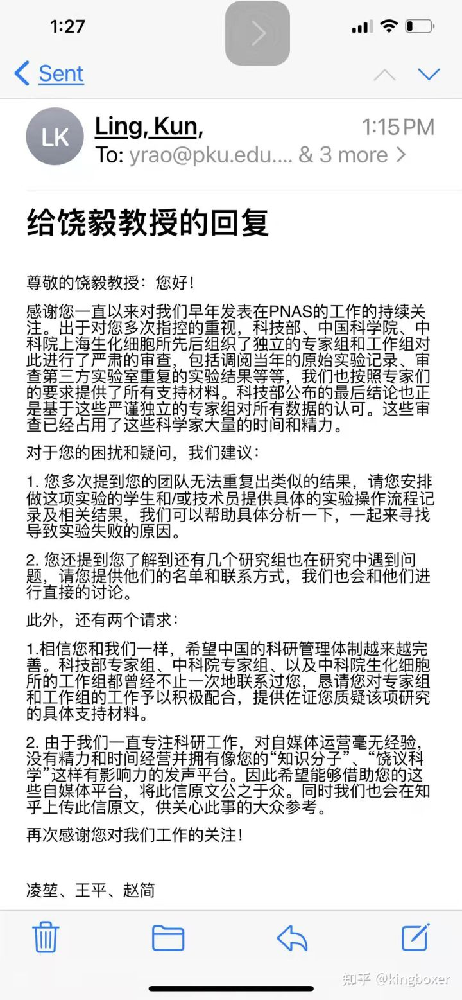
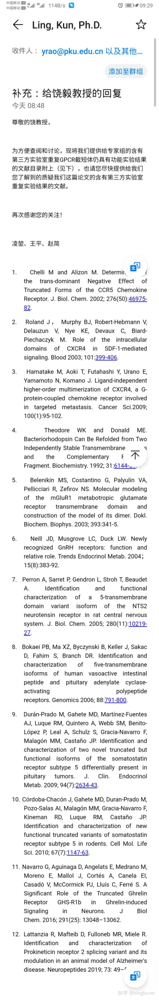

## 给饶毅教授的回复+补充回复

[给饶毅教授的回复+补充回复 - 知乎 (zhihu.com)](https://zhuanlan.zhihu.com/p/346566368?s_r=0)

尊敬的饶毅教授：您好！

感谢你一直以来对我们早年发表在PNAS的工作的持续关注。出于对您多次指控的重视，科技部、中国科学院、中科院上海生化细胞所先后组织了独立的专家组和工作组对此进行了严肃的审查，包括调阅当年的原始实验记录、审查第三方实验室重复的实验结果等等，我们也按照专家们的要求提供了所有支持材料。科技部公布的最后结论也正是基于这些严谨独立的专家组对所有数据的认可。这些审查已经占用了这些科学家大量的时间和精力。

对于您的困扰和疑问，我们建议：

\1. 您多次提到您的团队无法重复出类似的结果，能否请您安排做这项实验的学生和/或技术员提供具体的实验操作流程记录及相关结果，我们可以帮助具体分析一下，一起来寻找导致实验失败的原因。

\2. 您还提到您了解到还有几个研究组也在研究中遇到问题，请您提供他们的名单和联系方式，我们也会和她们进行直接的讨论。

此外，还有两个请求：

1.中国现行的科研管理体制还在不断完善，相信您也有此愿望。科技部专家组、中科院专家组、以及中科院生化细胞所的工作组都曾经不止一次的联系过您，还恳请您对专家组和工作组的工作予以积极配合，提供佐证您对该项研究质疑的支持材料。

\2. 由于我们一直专注科研工作，对自媒体运营毫无经验，没有精力和时间经营并拥有像您的“知识分子”“饶议科学”这样有影响力的发声平台。因此希望能够借助您的这些自媒体平台，将此信原文公之于众。同时我们也会在知乎上传此信原文，供关心此事的大众参考。

再次感谢您对我们工作的关注！

凌堃、王平、赵简

补充：给饶毅教授的回复

尊敬的饶教授，

为方便查阅和讨论，现将我们提供给专家组的含有第三方实验室重复GPCR截短体仍具有功能实验结果的文献目录附上（见下），也请您尽快提供给我们您了解到的质疑我们这篇论文的含有第三方实验室重复实验结果的文献。

再次感谢您的关注！

凌堃、王平、赵简

\1. Chelli M and Alizon M. Determinants of the trans-dominant Negative Effect of Truncated Forms of the CCR5 Chemokine Receptor. *J. Biol. Chem.* 2002; 276(50):46975-82.

\2. Roland J， Murphy BJ, Robert-Hebmann V, Delauzun V, Nye KE, Devaux C, Biard-Piechaczyk M. Role of the intracellular domains of CXCR4 in SDF-1-mediated signaling. *Blood* 2003; 101:399-406.

\3. Hamatake M, Aoki T, Futahashi Y, Urano E, Yamamoto N, Komano J. Ligand-independent higher-order multimerization of CXCR4, a G-protein-coupled chemokine receptor involved in targeted metastasis. *Cancer Sci.*2009; 100(1):95-102.

\4. Theodore WK and Donald ME. Bacteriorhodopsin Can Be Refolded from Two Independently Stable Transmembrane Helices and the Complementary Five-Helix Fragment. *Biochemistry.* 1992; 31:6144-51.

\5. Belenikin MS, Costantino G, Palyulin VA, Pellicciari R, Zefirov NS. Molecular modeling of the mGluR1 metabotropic glutamate receptor transmembrane domain and construction of the model of its dimer. *Dokl. Biochem. Biophys.* 2003; 393:341-5.

\6. Neill JD, Musgrove LC, Duck LW. Newly recognized GnRH receptors: function and relative role. *Trends Endocrinol Metab.* 2004；15(8):383-92.

\7. Perron A, Sarret P, Gendron L, Stroh T, Beaudet A. Identification and functional characterization of a 5-transmembrane domain variant isoform of the NTS2 neurotensin receptor in rat central nervous system. *J. Biol. Chem.* 2005; 280(11):10219-27.

\8. Bokaei PB, Ma XZ, Byczynski B, Keller J, Sakac D, Fahim S, Branch DR. Identification and characterization of five-transmembrane isoforms of human vasoactive intestinal peptide and pituitary adenylate cyclase-activating polypeptide receptors. *Genomics* 2006; 88:791-800.

\9. Durán-Prado M, Gahete MD, Martínez-Fuentes AJ, Luque RM, Quintero A, Webb SM, Benito-López P, Leal A, Schulz S, Gracia-Navarro F, Malagón MM, Castaño JP. Identification and characterization of two novel truncated but functional isoforms of the somatostatin receptor subtype 5 differentially present in pituitary tumors. *J. Clin. Endocrinol Metab.* 2009; 94(7):2634-43.

\10. Córdoba-Chacón J, Gahete MD, Duran-Prado M, Pozo-Salas AI, Malagón MM, Gracia-Navarro F, Kineman RD, Luque RM, Castaño JP. Identification and characterization of new functional truncated variants of somatostatin receptor subtype 5 in rodents. *Cell Mol. Life Sci.* 2010; 67(7):1147-63.

\11. Navarro G, Aguinaga D, Angelats E, Medrano M, Moreno E, Mallol J, Cortés A, Canela EI, Casadó V, McCormick PJ, Lluís C, Ferré S. A Significant Role of the Truncated Ghrelin Receptor GHS-R1b in Ghrelin-induced Signaling in Neurons. *J Biol Chem.* 2016; 291(25): 13048–13062.

\12. Lattanzia R, Mafteib D, Fulloneb MR, Miele R. Identification and characterization of Prokineticin receptor 2 splicing variant and its modulation in an animal model of Alzheimer's disease. *Neuropeptides* 2019; 73: 49–56.

