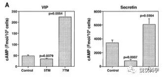
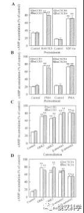
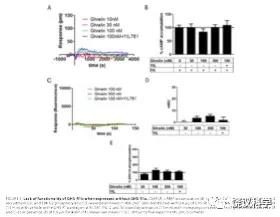

## 树欲静而风不止：劝裴钢的学生凌堃不要帮倒忙

[树欲静而风不止：劝裴钢的学生凌堃不要帮倒忙 (qq.com)](https://mp.weixin.qq.com/s/LYbRkIoZD0b9qIYfFGv2ww)

发件人: Transmissome

日期: Sunday, January 24, 2021 at 6:17 PM

至: "Ling, Kun, Ph.D."

抄送: ——-////—-

主题: Re: 补充：给饶毅教授的回复

树欲静而风不止：答裴钢学生凌堃等—不要帮倒忙

 

凌博士，

​     

​     2021年1月24日（周日）上午到中午有两个会议，迟复为歉。

 

​     因为我比您珍惜的那些专家时间少，所以，这封回复，只写了一遍，没有时间修改，原谅各种笔误。

 

  首先指出，认真读过您所开列12篇文章“提供给专家组的含有第三方实验室重复GPCR截短体仍具有功能实验结果的文献”后，正常的看法应该是：凌堃-裴钢于1999年“发现”的所谓五重跨膜可以与正常全长七重跨膜的GPCR受体一样传递信号的结果，二十二年来从未被严格的重复实验所验证过。（您列举的文章中有否定您结果的，分析见附件3。裴钢找张曙光出了高级黑的问题，您应该不是高级黑自己，而是帮我？）。

 

​     拜读来信，觉得您争论的对象应该首当其冲的是MIT的张曙光：如果GPCR截短体有传递信号的功能是定论，张曙光还能接受他的朋友弹冠相庆、说他2020年12月发表了巨大突破吗？

 

​     您坚持要找我，我也没有办法。虽然以前我集中交流对象是您的老师、三十年前的美国博士、当时已经是老师，而您那时是学生，如果出事，您确实有责任，但洋博士回国的导师责任很大。您毕业后在美国多年迄今只是副教授，您有没有考虑到裴钢对您的研究生培养可能有长期的副作用？您文献阅读能力似乎也有问题，这样说，是为了避免说您读懂了文献之后表达不诚实（从两种可能的批评中，相权取其轻）。

 

​     我并非所有交流都公开，有时是为了顾及对方，例如某些机构下滑的问题（2019年，我与科学院生化细胞所的所谓调查委员会的交流，迄今未公开，在您来信的逼迫下现公布于附件1）。

 

​     这次，我还没回复您之前，您就已经在多个渠道，包括“知乎”公开了。我不得已也公开回复。（张曙光老师也是如您一样，自行先公开，我才被迫也公开回复）。

 

​     纠正您所谓“科技部、中国科学院、中科院上海生化细胞所先后组织了独立的专家组和工作组对此进行了严肃的审查”。

 

事实上，就我直接所经历的，是上海生化细胞所组织了不独立于裴钢的、草率从事的、不负责任的、捍卫性质的调查（见附件1）。

 

2019年11月28日（周四）傍晚，我涉及批评裴钢的信件草稿给了脑计划当时的专家组，因为那时还有裴钢。11月29号（周五）有微信爆料这份草稿。在北京和上海的W、L、C、Z等教授、研究员于29日收到通知，称应裴钢要求，生化细胞所邀请他们参加“裴钢研究组1999年PNAS论文调查委员会”。 11月30日，生化细胞所的Z短信联系我，12月1日电子邮件建立联系。Z不是院士，我猜想他不可能不怕裴钢，实验回复有点慢。12月1日上午8点16分我第一次回复Z。但是，12月1日当天，生化细胞所的所谓调查报告就出来了。您应该帮我问问是否委员会还没开始工作就有调查报告的文字，委员会成员只是走过场签字（可能没有必要请更高的调查组调查上海生化细胞所是否有违程序正当性，恐怕不少单位都是这样的）。其中有委员到今天也不同意当时的内容。我上午刚刚试探性地开始有一点点回话下午就有调查结论不出12小时，从周五收到参与调查的通知到星期天得出调查结论不出48小时，上海生化细胞的速度都接近空前绝后了。您在美国，问问您现在的正常机构，这种调查能否称为“严肃”？

 

当然，此次事件，我们应该捍卫生化细胞所，因为最不负责任的是上海药物所。药物所从开始到现在，没有任何负责人要我去上海进行咨询、调查，其现任所领导第二天就对媒体宣称耿美玉没有问题。耿美玉所谓治疗老年痴呆症的GV971被很多人认为是假药。如果有负责任的调查，到上海药物所内部和中国药监局内部做匿名投票，会发现很多人不相信GV971。如果找到参与的医生和病人，就有可能知道：如果造假是怎么造假的。GV971销量很大、盈利很高。如果没有严格的调查，就不能排除GV971成为中国二十一世纪最大造假案的可能性。

 

让大家知道您和裴钢的问题，与耿美玉和绿谷药厂问题完全不在同一个层次。要不然，大家众目睽睽之下，真把您和裴钢当成最大的问题。您和裴钢不是现如今最大问题，而是相当容易纠正的问题，给《美国科学院院刊》致信，说不能重复，需要撤稿，就完了。给现在的青年研究员、学生，做一个榜样。

 

而耿美玉和绿谷药厂，做任何补救都不可能是榜样。如果有机构、有吃国家皇粮的人对国家负责，不欺上瞒下，就很有可能发现造假的证据，而不应该是上海药物所那样第二天就宣布结论。

 

这次调查过程中，如果有您所说的中国科学院负责调查的专家组，也完全没有询问我。科技部的行政与我有交流，但专家组没有。我认为在这次的过程中，做的最好的是教育部、其次是科技部。科技部隔了几层，不容易参与调查。中国科学院生化细胞所做的第二差，药物所做的最差。

 

另外，您说调查“已经占用了这些科学家大量的时间和精力”。如果确实占用了，那是你们这些当事人造成的结果。而且，不一定用了他们很多时间，从您提供的12篇文章来看，他们有可能几乎都没有读原文，如果每一位专家都读过摘要，也会对您和裴钢的结果存疑。因为您提供的有些文章的摘要就已经不支持您的结果。

 

​     现在回答您的问题：

1）    我实验室确实重复过您的实验，这一事实裴钢肯定知道。他现在一定要说不记得，我也没有办法，又不能建议他去服用971，建议了估计他也不会中计，而且猜想他太太、药理学的院士马兰也不会支持他服用971。但其实我估计，他当时也告诉了您。要不然，您和后来几位，为什么不发表第二篇报道三重、一次跨膜的文章？您也回答试试。我批评张曙光的信已经说了，这一问题应该您和裴钢回答，你们怎么绕开了？

 

我实验室那时在美国St Louis，此后我实验室换了国家和城市，在北京就换了几次地方。而裴钢实验室就一直在上海。先应该要求您当时所在的裴钢实验室拿出实验笔记，或您自己拿出实验笔记。您和裴钢实验室有责任保留自己研究的笔记。我实验室从旁帮助您和裴钢，完全没有人会要求我们需要多年保持有关您的研究的笔记。

 

我们都应该接受第三方重复的结果，而您和裴钢没有理由反对第三方重复。例如可以您寄给大家实验材料，大家可以做。我实验室愿意在任何部委监督组监督下，做钙离子是否升高的实验。

 

您实验室也可以做。裴钢也可以。您和裴钢有这么大的突破都不肖于重复，让科学界的正常人大多数都觉得很奇怪。如果可以重复，为什么害怕重复？

​     

2）    现在也有实验室做了，重复不出您的结果。但他们慑于裴钢，不敢公开。您这种叫板，是欺负他们。

 

既然您在美国，应该换一个模式，您叫板美国的GPCR专家，质问他们为什么不修改教科书，为什么不接受您和裴钢22年前的突破？

 

或者，我们三人（您、裴钢、我）与美国GPCR的诺奖得主等权威组一个微信群，明确讨论：今天他们是否接受您和裴钢二十二年前的结果？

 

您如果要再加上张曙光，也可以，让大家看看张曙光的结果是否被权威专家接受，还是会被评论为lousy、not rigorous？

 

您和裴钢既然要那些怕裴钢的实验室出来，何必不允许由科学院道德委员会指定的实验室来做？您如果不让道德委员会找第三方，而公开叫板谁私下做过要公开姓名的做法，我们不应该用成语进行形容吧？

 

3）    有关所谓科技部、科学院、生化细胞所不止一次联系我，上面已经说明了，而且在附件1还将email出示。生化细胞所这种不负责任的做法，让我对捂盖子的机构非常警惕。而中国科学院的所谓工作组，从头到尾没与我联系。实际上，科学院的工作组，应该因为您/裴钢和耿美玉两个事件联系我，但它没有。您不妨先找他们说理。

 

4）    与您工作过的中国机构、和在中国扮演科学家的有些人不一样，我从来分开公事和私事。《知识分子》现属于非盈利的公益组织“智识学研社”，不是我个人的。我不会公器私用。近年发生几次其他人与我的矛盾，我从来不从《知识分子》或《赛先生》发反击文字。我只用“饶议科学”。虽然您已经用了知乎，我下面仍然按您邀请转载您的来信原文（附件2）。

 

现在我问您一个问题：您相信张曙光2020年12月iScience文章的图5吗？

 

这是他实验室唯一研究缩短的受体能否介导钙浓度增加的实验结果。如果您相信，那么它显示CXCR4缩短后毫无介导钙浓度升高的作用。否定了您的结果。

 

如果您不相信，还能用张曙光作为支持的后盾吗？

 

张曙光的邮件还提供了一篇文章Trettel et al (2003) JBC 278:40980-40988.。这篇文章明确说缩短的受体没有信号传递功能。我也不知道张曙光老师是帮您和裴钢，还是张老师可怜我看文献太少而帮我。

 

 

文献支持您的结果吗？

 

您辛辛苦苦从上万篇文章中找到所谓重复了您结果的区区12篇文章。

 

而其中没有一篇是研究与您一样的CCR5和CXCR4的缺乏72个氨基酸残基的五重跨膜蛋白。所以，完全阙如严格的重复实验。

 

最奇怪的是裴钢实验室自己就没有继续扩大战果，在做出先驱的、举世震惊的突破后，没有再接再厉，研究与众不同的信号传递机制，而从此退出。如果不是自己不信，是什么？

 

迄今最接近凌堃-裴钢的实验，是2020年12月张曙光实验室发表的，但其质量很差，其钙浓度的结果，裴钢实验室、您实验室，或问问美国做GPCR的实验室，会不会哑然失笑？而且张曙光的文章还有与您结果相矛盾的，iScience的文章作为令箭而误伤友军，这种中老年科学家高级黑年轻科学家的做法，恐怕不是很合适。下次，您和裴钢搬救星的时候，应该有所选择，这样大家都可以免于当众脸红，或者出虚汗。

 

那12篇文章可以分为三类：2篇仍然支持“凌堃-裴钢的结果不能重复”，其中有文章与凌堃-裴钢结果矛盾（附件3含与您矛盾的图片）；6篇支持“凌堃-裴钢的结果没有被重复”，4篇支持“需要通过实验进一步检验凌堃-裴钢的结果能否被重复”（分析见附件3）。

 

​     您和裴钢如果不服气，可以给那12篇论文的通讯作者写信，问他们：“你们是否重复凌堃-裴钢实验并验证了其结果？”（英文是：Have you ever replicated the results of Ling et al. 1999 PNAS exactly?）。不能排除12个人都说NO的可能性。不信，你们试试看。

 

我好意回报一句正面的勉励：只有更爱真理才能显示吾爱吾师，要不然，出现谬误把老师拖进去了，不妥当。

 

饶毅

 

附件1 与上海生化细胞所调查委员会的邮件

发件人: Transmissome < >

日期: Saturday, December 14, 2019 at 4:40 PM

至: W, C, Z, Z,L

抄送: ABCDEFG

主题: 裴钢研究组1999年PNAS论文调查委员会会议调查意见

 

W、L、C、Z、Z诸教授，

​      （并B教授、C教授）

 

​      因为12月12日看到所谓由“W、L、C、Z、Z”诸位签署的“裴钢研究组1999年PNAS论文调查委员会会议调查意见”（一下简称“调查意见”），特奉上我和Z教授的通讯，并加以评论。

 

回顾时间

 

​      2019年11月28日（周四）傍晚，我的草稿给了脑计划专家组，包括不应该在脑计划专家组的外行裴钢本人。

 

​      11月29号（周五）有微信爆料。W、L、C、Z于29日收到通知，称应裴钢要求，生化细胞所（“分子细胞科学卓越创新中心”）邀请参加“裴钢研究组1999年PNAS论文调查委员会”。

 

​      两天之后的12月1日（星期天），就立即出了调查意见。这不仅是中国对于学术不端时间最快的调查，也是世界对学术不端调查速度的空前绝后的第一。

 

​                        真乃兵贵神速。

 

​      12月2日，星期一《中国科学报》发表裴钢专访“裴钢院士专访：困于’众所周知’，何谈’科技创新’”。

 

​      12月13日，新闻报道“中科院：初步核实未发现裴钢院士论文造假证据”，称“从中国科学院分子细胞卓越创新中心获悉…该中心已请外部专家进行初步核查，没有发现该论文造假的证据”。

 

调查不公

​      

​      11月30日，Z短信联系我，12月1日电子邮件建立联系。12月1日上午8点16分，我第一次回复Z。从那时到12月3日，我有多次回复。为了保证信息的畅通和记录，这些通讯也抄送C老师。但是，Z教授把我的回复转给调查委员会的W、L、C、Z等了吗？

 

​      委员会其他成员给我提了任何问题吗？显然没有。

 

​      也就是说，“分子细胞科学卓越创新中心”的调查，正如我所担心的，并非公正的调查：匆匆忙忙，不问我，联系我也是虚伪的，并没有把我提供的信息给委员会。

 

​      而裴钢匆匆忙忙需要这一委员会，是他策划利用委员会，星期天（12月1号）就拿到他所需要的调查意见，12月2号（周一）就对记者专访，12月13号对外发布。

 

​      这提示裴钢不是为了公正，而是希望利用专家意见，然后闹事。

 

国际常规

 

​      裴钢这样做，是他坚持违反国际常规，同时坑害生化细胞所。他不过是要造成专家说他没有造假，那么我说他造假就可以被他起诉的可笑逻辑。

 

​      最近的国际著名事件，是2012年日本的小保方晴子发表的Nature文章后不久，美国UC Davis的Paul Knoepfler在博客上公开质疑其真实性。日本因而启动调查，发现是造假。在整个过程中，并未要求Knoepfler提供证据，而是经过严格的调查，发现造假。

 

​      为什么提出裴钢1999的PNAS文章是造假

 

​      提出裴钢文章是造假的原因有多个，其中有些给Z暗示了。当然，正如所预料的，他并不敢给委员会。原本就有利益冲突的委员会，在所谓调查过程中，也被隐瞒基本信息。

 

​      GPCR需要七重跨膜，才能有信号转导的功能，不仅是众所周知，而且是被很多实验室多次验证。

 

​      在有上万篇文章的GPCR领域，当然会出现各种错误，但是错误率并不高，号称GPCR不需要7重跨膜的文章，一共不到十篇，而且它们有共同特征：

​                  凡是有这种文章的，都是来自同一个实验室，也就是说A实验室号称某个（如X）GPCR不要7重跨膜区，那么没有第二个实验室重复这一结果（X GPCR不用7重跨膜就能够起功能），而B实验室可能号称Y GPCR可以不用七重跨膜。并没有出现两个实验室相互验证的情况。而是两个实验室都出现毛病。

​                  这些文章的第二个特征是，其实同一个实验室一般也不能重复这种结果，所以一般来说都没有下文。

​                  贵调查委员会读裴钢提供的附件三、综述目录的时候，显然一天的时间太短，来不及总结出以上两个简单特征。

​                  一个有上万论文的领域，可以说什么鸟都有。诸位需要足够的时间阅读和思考。贵委员会读的附件三，也是裴钢障眼法，那篇文章不是2012年发表的，而是2015年发表的，贵委员会的调查报告急急忙忙把年代都写错了（还是裴钢写错了，诸位没有时间纠正），那篇结构生物学的文章根本不能说功能不需要第一和第二跨膜区，只能说结构上，两个跨膜区在哪里，结构生物学不是功能检测、不能代替功能检测。所以，你们“认为该论文‘只有造假才能产生’的言论过于武断不符合科学事实”这一句话才是武断。

​                  其实，你们有几位不熟悉GPCR，而懂的一位L博士，害怕裴钢。如果L博士到国际上去说GPCR可以不用7重跨膜，他自己都会脸红。不信，我们都写一封信给GPCR的两位诺奖，裴钢的老师Robert Leftkowitz、师兄Brian Kobilka，问问他们能否断言GPCR需要7重跨膜，不能5重跨膜？

 

​      中国这一争论，最大的危害是让国内生物学的学生，从此独树一帜，认为GPCR可以不用7重跨膜。这不仅是全世界（包括中文）教科书的内容，它是全世界真科学家研究的结论，包括这一领域的L博士和他的合作者Ray Stevens。我们中国不能从此成为世界的笑料。

 

​      裴钢实验室1999年论文是号称CCR5和CXCR4两个GPCRs可以不要7重跨膜，而只要5重跨膜。20年来，全世界没有一个实验室重复了这一结果。这一事实包含裴钢实验室自己也没有第二个学生重复了这一结果。如果不要7重跨膜，当然是非常重要的发现，这么重要的发现，裴钢从1999年之后就完全不继续？当然不是，而是其他学生不能重复。裴钢实验室的GPCR研究可没有停止在1999年，还做了多年。

 

​      事实上，我实验室早就用过裴钢实验室的试剂，但不能重复这一结果，而且我早就告诉裴钢本人了。就在裴钢这样公开闹的情况下，我都没有把这一事实说出来，给他留有余地，让他思过改正。我实验室在十几年前就发表过三篇涉及GPCR的文章，虽然不是信号转导，但我那时就熟悉这一领域。今天我实验室大量研究GPCR，这一问题就更熟悉，所以我也比较在意中国迄今没有处理这一谬误。

 

​      我还有其他理由，但贵委员会已经证明自己是不可靠、不公平的委员会，为了避免让裴钢更加充分的进行各种活动，其他的理由我现在就暂且不说了。

 

验证实验

 

​      在科学上，事实胜于雄辩。

​      GPCR激活后引起钙内流增加，是很容易做的实验。

​      CCR5和CXCR4，也是很容易得到的。L博士就帮助Ray Stevens用中国纳税人的钱，重新化学合成过全部GPCR（包括已经研究过不再需要做结构的GPCR），曾经被我电子邮件严厉批评。现在这两个GPCRs可以派用场了，中国人的钱可以少浪费两个。

​      可以请第三方重复裴钢1999年PNAS文章的图3、4、5。让真相大白。

 

饶毅

2019年12月14日

此信抄送：

​      中国科学院生物医学部：A、B、C、D、E、F、G、H。

 

附件2 凌堃来信照登

 

发件人: "Ling, Kun, Ph.D." 

日期: Sunday, January 24, 2021 at 3:15 AM

至: Transmissome 

抄送: wangp, 赵, Gang Pei 

主题: 给饶毅教授的回复

 

尊敬的饶毅教授：您好！

感谢您一直以来对我们早年发表在PNAS的工作的持续关注。出于对您多次指控的重视，科技部、中国科学院、中科院上海生化细胞所先后组织了独立的专家组和工作组对此进行了严肃的审查，包括调阅当年的原始实验记录、审查第三方实验室重复的实验结果等等，我们也按照专家们的要求提供了所有支持材料。科技部公布的最后结论也正是基于这些严谨独立的专家组对所有数据的认可。这些审查已经占用了这些科学家大量的时间和精力。

对于您的困扰和疑问，我们建议：

\1. 您多次提到您的团队无法重复出类似的结果，请您安排做这项实验的学生和/或技术员提供具体的实验操作流程记录及相关结果，我们可以帮助具体分析一下，一起来寻找导致实验失败的原因。

\2. 您还提到您了解到还有几个研究组也在研究中遇到问题，请您提供他们的名单和联系方式，我们也会和他们进行直接的讨论。

此外，还有两个请求：

1.相信您和我们一样，希望中国的科研管理体制越来越完善。科技部专家组、中科院专家组、以及中科院生化细胞所的工作组都曾经不止一次地联系过您，恳请您对专家组和工作组的工作予以积极配合，提供佐证您质疑该项研究的具体支持材料。

\2. 由于我们一直专注科研工作，对自媒体运营毫无经验，没有精力和时间经营并拥有像您的“知识分子”、“饶议科学”这样有影响力的发声平台。因此希望能够借助您的这些自媒体平台，将此信原文公之于众。同时我们也会在知乎上传此信原文，供关心此事的大众参考。

再次感谢您对我们工作的关注！

 

凌堃、王平、赵简

 

发件人: "Ling, Kun, Ph.D." 

日期: Sunday, January 24, 2021 at 8:48 AM

至: Transmissome

抄送: oy,mzzhai,yanghuanming,qiang.boqin, Bai Chunli, jh-cao, wangp, zhaojian,gang pei 

主题: 补充：给饶毅教授的回复

 

尊敬的饶教授，

 

为方便查阅和讨论，现将我们提供给专家组的含有第三方实验室重复GPCR截短体仍具有功能实验结果的文献目录附上（见下），也请您尽快提供给我们您了解到的质疑我们这篇论文的含有第三方实验室重复实验结果的文献。

 

再次感谢您的关注！

 

凌堃、王平、赵简

 

\1.  Chelli M and Alizon M. Determinants of the trans-dominant Negative Effect of Truncated Forms of the CCR5 Chemokine Receptor. J. Biol. Chem. 2002; 276(50):46975-82.

\2.  Roland J， Murphy BJ, Robert-Hebmann V, Delauzun V, Nye KE, Devaux C, Biard-Piechaczyk M. Role of the intracellular domains of CXCR4 in SDF-1-mediated signaling. Blood 2003; 101:399-406.

\3.  Hamatake M, Aoki T, Futahashi Y, Urano E, Yamamoto N, Komano J. Ligand-independent higher-order multimerization of CXCR4, a G-protein-coupled chemokine receptor involved in targeted metastasis. Cancer Sci.2009; 100(1):95-102.

\4.  Theodore WK and Donald ME. Bacteriorhodopsin Can Be Refolded from Two Independently Stable Transmembrane Helices and the Complementary Five-Helix Fragment. Biochemistry. 1992; 31:6144-51.

\5.  Belenikin MS, Costantino G, Palyulin VA, Pellicciari R, Zefirov NS. Molecular modeling of the mGluR1 metabotropic glutamate receptor transmembrane domain and construction of the model of its dimer. Dokl. Biochem. Biophys. 2003; 393:341-5.

\6.  Neill JD, Musgrove LC, Duck LW. Newly recognized GnRH receptors: function and relative role. Trends Endocrinol Metab. 2004；15(8):383-92.

\7.  Perron A, Sarret P, Gendron L, Stroh T, Beaudet A. Identification and functional characterization of a 5-transmembrane domain variant isoform of the NTS2 neurotensin receptor in rat central nervous system. J. Biol. Chem. 2005; 280(11):10219-27. 

\8.  Bokaei PB, Ma XZ, Byczynski B, Keller J, Sakac D, Fahim S, Branch DR. Identification and characterization of five-transmembrane isoforms of human vasoactive intestinal peptide and pituitary adenylate cyclase-activating polypeptide receptors. Genomics 2006; 88:791-800.

\9.  Durán-Prado M, Gahete MD, Martínez-Fuentes AJ, Luque RM, Quintero A, Webb SM, Benito-López P, Leal A, Schulz S, Gracia-Navarro F, Malagón MM, Castaño JP. Identification and characterization of two novel truncated but functional isoforms of the somatostatin receptor subtype 5 differentially present in pituitary tumors. J. Clin. Endocrinol Metab. 2009; 94(7):2634-43. 

\10. Córdoba-Chacón J, Gahete MD, Duran-Prado M, Pozo-Salas AI, Malagón MM, Gracia-Navarro F, Kineman RD, Luque RM, Castaño JP. Identification and characterization of new functional truncated variants of somatostatin receptor subtype 5 in rodents. Cell Mol. Life Sci. 2010; 67(7):1147-63.

\11. Navarro G, Aguinaga D, Angelats E, Medrano M, Moreno E, Mallol J, Cortés A, Canela EI, Casadó V, McCormick PJ, Lluís C, Ferré S. A Significant Role of the Truncated Ghrelin Receptor GHS-R1b in Ghrelin-induced Signaling in Neurons. J Biol Chem. 2016; 291(25): 13048–13062.

\12. Lattanzia R, Mafteib D, Fulloneb MR, Miele R. Identification and characterization of Prokineticin receptor 2 splicing variant and its modulation in an animal model of Alzheimer's disease. Neuropeptides 2019; 73: 49–56.

 

附件3 分析凌堃寄来的12篇文章

 

凌堃对这些文章的解释，虽然没有直接给我，但有人在科学网帮助您发了，而且发在张曙光一道，说明您和张曙光有某种协调。（http://news.sciencenet.cn/htmlnews/2021/1/452248.shtm）

\1.   Chelli M and Alizon M. Determinants of the trans-dominant Negative Effect of Truncated Forms of the CCR5 Chemokine Receptor. J. Biol. Chem. 2002; 276(50):46975-82.

凌堃的说明：“在研究中，Chelli和 Alizon人为设计制作了多种不同跨膜区缺失的CCR5变体，其中有一些仍然表达在细胞膜上并行使功能。这一工作的结果表明，第1、第2跨膜区不是CCR5行使功能所必需的。”

事实是：Chelli和Alizon发现CCR5受体缺乏跨膜区后，都不能有信号传递功能，相反，有一些缩短的受体不仅不能传递信号，反而抑制全长的正常受体传递信号。这篇文章只能用于支持“凌堃-裴钢的结果不能重复”。

\2.   Roland J， Murphy BJ, Robert-Hebmann V, Delauzun V, Nye KE, Devaux C, Biard-Piechaczyk M. Role of the intracellular domains of CXCR4 in SDF-1-mediated signaling. Blood 2003; 101:399-406.

凌堃的说明：“Biard-Piechaczy课题组研究了人为设计制作的不同胞内环缺失的CXCR4截短变体，其结果表明第一胞内环不是CXCR4被配体激活所必需的，这一点与我们的结果一致。”

事实是：Biard-Piechaczy课题组没有发现CCR5受体在缺乏跨膜区后，可以有信号传递功能。您受批评的关键是缺乏两个跨膜区，而不仅仅是缺乏一个胞内段。这篇文章只能用于支持“凌堃-裴钢的结果没有被重复”。

 

\3.   Hamatake M, Aoki T, Futahashi Y, Urano E, Yamamoto N, Komano J. Ligand-independent higher-order multimerization of CXCR4, a G-protein-coupled chemokine receptor involved in targeted metastasis. Cancer Sci.2009; 100(1):95-102.

凌堃的说明：“由于能够形成二聚体或多聚体，缺失不同跨膜区的多种5次跨膜或3次跨膜的CXCR4变体能够在细胞膜表面正常表达。”

事实是：能够在细胞膜表达，不等于有信号传递功能。其实他们测都没有测信号传递功能，估计他们也与正常科学家一样不相信缺乏跨膜区会有信号传递功能，所以没有检测。这篇文章只能用于支持“凌堃-裴钢的结果没有被重复”。

 

\4.   Theodore WK and Donald ME. Bacteriorhodopsin Can Be Refolded from Two Independently Stable Transmembrane Helices and the Complementary Five-Helix Fragment. Biochemistry. 1992; 31:6144-51.

凌堃的说明：“G蛋白偶联受体bacteriorhodopsin存在缺失第1和第2跨膜区的5次跨膜天然变体，这个5跨膜变体在体外系统中也可以表达在细胞膜上。”

事实是：（这篇文章应该是Kahn and Engelman。不应该用Theodore and Donald）文章发现五重跨膜蛋白可以出现在细菌细胞膜表面，没有显示有传递信号的功能。您受批评的是缺乏两个跨膜区还能传递信号。这篇文章只能用于支持“凌堃-裴钢的结果没有被重复”。

 

 

\5.   Belenikin MS, Costantino G, Palyulin VA, Pellicciari R, Zefirov NS. Molecular modeling of the mGluR1 metabotropic glutamate receptor transmembrane domain and construction of the model of its dimer. Dokl. Biochem. Biophys. 2003; 393:341-5.

凌堃的说明：“G蛋白偶联受体mGluR1需要形成二聚体来激活G蛋白信号通路。有趣的是，这个研究表明，缺失第1和第2. 跨膜区不影响这种二聚体的形成。”

事实是：这是一篇做模型的文章，用它就好像“黔驴技穷”了。它完全没说缺乏跨膜区可以有信号传递功能。其实，可以形成二聚体的可能是抑制信号传递。您受批评的关键是缺乏两个跨膜区而有信号传递功能。这这篇文章只能用于支持“凌堃-裴钢的结果没有被重复”。

 

\6.   Neill JD, Musgrove LC, Duck LW. Newly recognized GnRH receptors: function and relative role. Trends Endocrinol Metab. 2004；15(8):383-92.

凌堃的说明：“编码GnRH-II受体的基因除表达野生型7次跨膜受体外，也可以产生5次跨膜的天然截短变体。这一5跨膜GnRH-II受体缺失第1和第2跨膜区，但仍能响应配体的特异性刺激，发挥受体功能。”

事实是：这是一篇综述，不是原始研究论文。它发现有编码五重跨膜的基因，但完全没有验证这种基因编码的蛋白质有传递信号的功能。它提醒大家凌堃-裴钢的论文说五重跨膜有功能。（Although the functions of human and pig 5TM receptors have not been tested, it should be noted that a 5TM chemokine receptor is functional [14]，引文14就是凌堃-裴钢的1999年文章）。因为这篇文章也发表17年了，有关研究人员如果验证了五重跨膜的传递信号功能，应该会发表。既然没有这一后续文章发表，说明这篇文章更可以用于支持“凌堃-裴钢的结果没有被重复”。

 

 

\7.   Perron A, Sarret P, Gendron L, Stroh T, Beaudet A. Identification and functional characterization of a 5-transmembrane domain variant isoform of the NTS2 neurotensin receptor in rat central nervous system. J. Biol. Chem. 2005; 280(11):10219-27. 

凌堃的说明：“二型神经降压素NTS2 受体是一种G蛋白偶联受体，其编码基因能够产生5次跨膜的天然变体。该变体显示与野生型NTS2受体一样的组织/器官表达谱，并通过形成同源或异源二聚体和多聚体完成受体功能”

事实是：这篇文章研究的是另外一个GPCR的五重跨膜变体（vNTS2）。文章显示，它上细胞膜是正常全长受体的5千分之一。检验了它一个信号传递功能（MAPK的激活），确实见到弱的活性。但是，它与您文章不同，用的不是同一个受体，而且您发表的是五重跨膜与正常几乎一模一样，而不是大大降低。另外，vNTS2的这一功能，以后该实验室自己都没有继续后续工作，因此其意义和可重复性皆有待考量。这篇文章可以用于支持“凌堃-裴钢的结果需要重复才知道是否确切”。

 

\8.   Bokaei PB, Ma XZ, Byczynski B, Keller J, Sakac D, Fahim S, Branch DR. Identification and characterization of five-transmembrane isoforms of human vasoactive intestinal peptide and pituitary adenylate cyclase-activating polypeptide receptors. Genomics 2006; 88:791-800.

凌堃的说明：“神经内分泌受体VPAC1和VPAC2是G蛋白偶联受体，其编码基因能够产生缺失第6第7跨膜区的5次跨膜天然变体。该变体显示与野生型受体不同的细胞/组织表达谱，仍能结合配体并行使部分受体功能。”

事实是：这篇文章发现缺乏第6和第7次跨膜区后，VPAC五重跨膜受体完全缺乏介导cAMP的信号传递功能，但有对于某些蛋白质磷酸化的功能。它与您的受体不同，而更加相反的是，它完全看不见cAMP升高（其图6A），而您被批评的文章显示五重跨膜受体介导的cAMP反应与正常全长受体一样强（您的图5 A、B、C、D）。这篇文章可以用于支持“凌堃-裴钢的结果没有被重复，其中有明显与之矛盾的结果（图A对图5”。

以上为Bokaei 等，图6A

以上为凌等，图5，注意凌堃-裴钢不可能是偶尔一次，而是四个实验一再显示cAMP增加在五重跨膜和七重跨膜是一模一样。

 

\9.   Durán-Prado M, Gahete MD, Martínez-Fuentes AJ, Luque RM, Quintero A, Webb SM, Benito-López P, Leal A, Schulz S, Gracia-Navarro F, Malagón MM, Castaño JP. Identification and characterization of two novel truncated but functional isoforms of the somatostatin receptor subtype 5 differentially present in pituitary tumors. J. Clin. Endocrinol Metab. 2009; 94(7):2634-43. 

凌堃的说明：“人类生长抑素SST5受体是一种G蛋白偶联受体。这个研究发现，SST5受体基因可以产生只有5个跨膜区的仍然具备功能的天然变体。”

事实是：这篇用钙浓度检测的文章，确实发现SST5的短受体有介导提高钙浓度的功能。但是，它用的是SST5，不是您用的CCR5、CXCR4，而且，它在发现缺乏关键对照：没有转染SST5或其缩短受体的细胞，对配体有没有反应。所以，一方面它似乎确实显示不用七重跨膜有可能有信号传递功能，另外一方面，它缺乏关键对照。

因为它用的受体也与您的受体不同，这篇文章可以用于支持“应该通过实验验证凌堃-裴钢的结果能否被重复”。

 

\10. Córdoba-Chacón J, Gahete MD, Duran-Prado M, Pozo-Salas AI, Malagón MM, Gracia-Navarro F, Kineman RD, Luque RM, Castaño JP. Identification and characterization of new functional truncated variants of somatostatin receptor subtype 5 in rodents. Cell Mol. Life Sci. 2010; 67(7):1147-63.

凌堃的说明：“Castaño研究组的后续研究发现，SST5受体基因还能够产生只有4，2，或1个跨膜区的天然截短变体。对照7次跨膜的野生型受体，这些跨膜区缺失的变体表现出相似的表达水平和功能。”

事实是：这篇文章确实发表SST5的缩短突变。号称4重、2重、一次跨膜都能够介导引起钙浓度升高。但是，这样文章与“凌堃-裴钢”一样，缺乏对照，没有做在没有转染受体的细胞内，是否因为有内源性受体，已经能够对配体有反应。

这篇西班牙科学家发表的文章的数据如果是真实可信的，那么就是GPCR领域巨大的突破，只需要一次跨膜就可以了，不用七重跨膜。但是，它在PubMed只被引用25次，其中包括被同一实验室引用两次。Google Scholar引用68次。十一年来，全世界没有一个实验室独立于该实验室发表重复其介导信号传递结果的文章。通常的逻辑告诉人们，这个实验室的两篇文章（文献9和这篇文献10）应该都属于领域内部被广泛接受的文章（客气一点说）。如果广为接受，那么其他人就应该可以重复，教科书就应该改写，不用等十一年。最大的可能，这两篇文章不被公认是因为也不被相信。

这篇文章可以用于支持“应该通过实验看看凌堃-裴钢的结果能否被重复”。

 

\11. Navarro G, Aguinaga D, Angelats E, Medrano M, Moreno E, Mallol J, Cortés A, Canela EI, Casadó V, McCormick PJ, Lluís C, Ferré S. A Significant Role of the Truncated Ghrelin Receptor GHS-R1b in Ghrelin-induced Signaling in Neurons. J Biol Chem. 2016; 291(25): 13048–13062.

凌堃的说明：“人野生型GHS受体基因除了产生7次跨膜的GPCR外，还能够产生5次跨膜截短受体。这个五次跨膜的GHS受体可以与神经降压素NTS1受体形成异源受体二聚物，产生新的生理作用，这一发现可能为抑制非小细胞肺癌细胞生长，提供了全新的药物靶标。”

事实是：这篇研究GHS受体，五重跨膜的R1b受体单独是没有介导信号作用的。其图3完全否定五重跨膜的受体单独传递信号功能。而您的文章是五重跨膜的可以单独起信号传递功能。它与您矛盾。这篇文章可以用于支持“凌堃-裴钢的结果没有被重复”。

\12. Lattanzia R, Mafteib D, Fulloneb MR, Miele R. Identification and characterization of Prokineticin receptor 2 splicing variant and its modulation in an animal model of Alzheimer's disease. Neuropeptides 2019; 73: 49–56.

凌堃的说明：“Prokineticin receptor 2（PKR2）是一种GPCR，通过Gq、Gi、和Gs分别调控胞内钙转运、STAT3激活、和cAMP合成。研究发现PKR2基因转录产物存在天然剪切变体，产生一个缺失第1-3跨膜区的截短变体。这个变体仍然能在细胞膜上表达，并保留了结合配体并激活Gq和Gs的功能。”。

事实是：这篇意大利科学家发表的文章，在酵母中研究老鼠的PKR2。它发现四重跨膜可以介导beta-gal酶活性的增加。它与您不同的受体，没有检测您检测的钙或cAMP。它也没有用哺乳动物的细胞。文章发表后，尚无实验室验证其结果。但是这篇文章只有两年，目前不知道是否有人重视其中一个结果。这篇文章可以用于支持“凌堃-裴钢的结果需要实验进一步验证”。