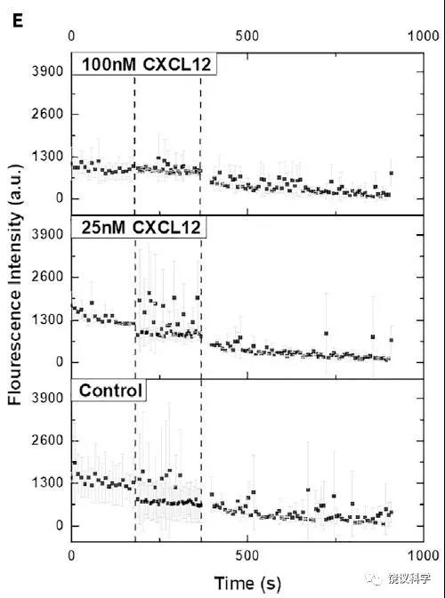
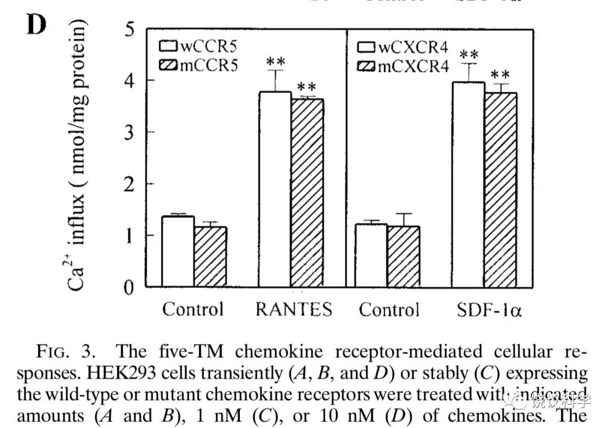
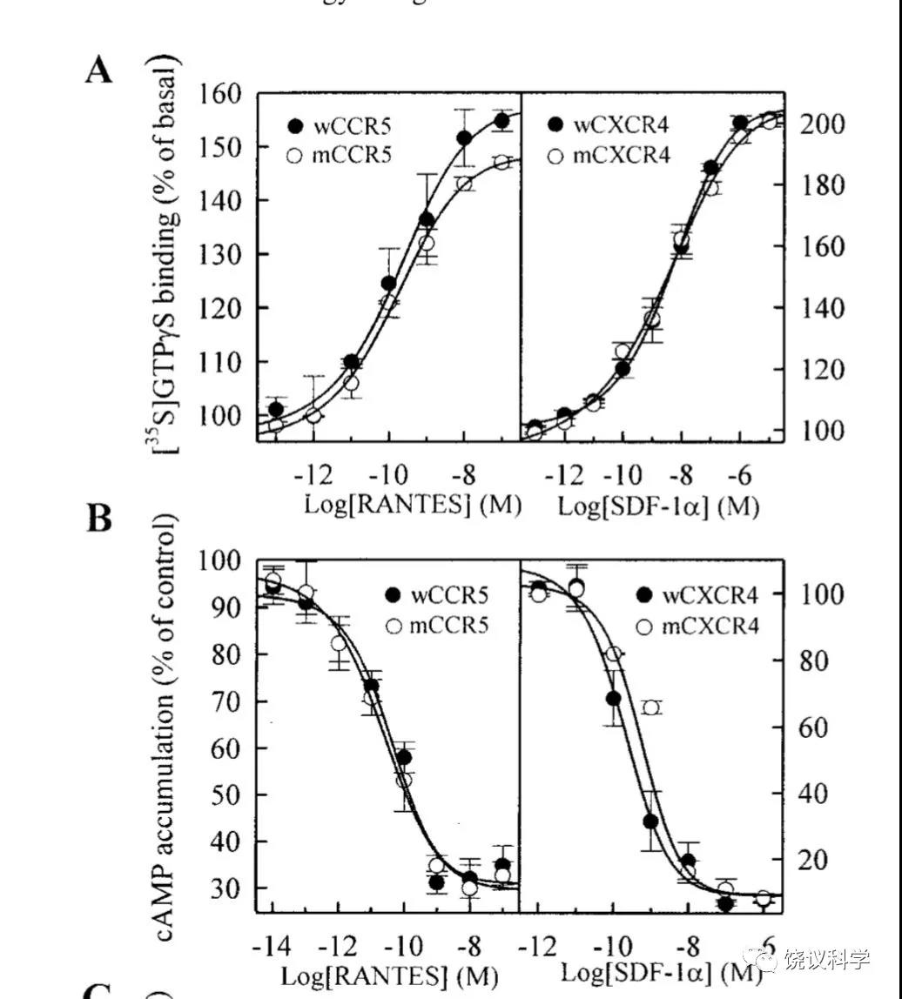

## 实验是检验张曙光pk裴钢对错的唯一标准

[实验是检验张曙光pk裴钢对错的唯一标准 (qq.com)](https://mp.weixin.qq.com/s/yT09t9dVn4OtKrJatt6SKA)

发件人: Transmissome

日期: Saturday, January 23, 2021 at 6:04 PM

至: xxxcashq.ac.cn

主题: 解决张曙光与裴钢实验结果矛盾的方法是第三方重复实验

中国科学院道德建设办公室，

 

   谢谢中国科学院道德建设委员会接受举报。

 

   需要说明，其实每一步我都是被动的。有人向基金委举报我，2019年基金委致函我新到的工作单位，蓄意造成不良影响，我不得不回复基金委，在初稿上列举了裴钢。而裴钢在上海法庭起诉我。现在，裴钢又有预谋地协调张曙光公开对我进行人身攻击。我只好公开我的回复。

 

   在此补充举报材料：美国麻省理工学院（MIT）的张曙光博士提供的，他实验室的有关GPCR的最新论文（Qing et al., 2020）。该文图5所示，截短的（非七重跨膜）受体不能介导25nM配体引起的细胞内钙浓度升高。而“凌堃-裴钢”论文（Ling et al., 1999）的图3D声称五重跨膜受体可以与全长的正常受体一样介导10nM的配体引起的细胞内钙浓度升高。这两种结果截然相反。

 

  既然张曙光非常强烈地认为他的实验等同于“凌堃-裴钢”，那么张曙光等于在事实上支持举报裴钢，无论张曙光口头上怎么说。也就是：事实胜于雄辩，虽然张曙光出面口头上说重复了裴钢结果，张曙光文章的图片和文字实际显示的结果与裴钢的结果相互矛盾。

 

  解决张曙光与裴钢实际矛盾最有效的方法，是请有公信力的第三方来进行重复实验。

 

   附五点注意：

 

   1）被举报论文的第一作者中文姓名为凌堃，所以这篇论文简称应该为“凌堃-裴钢”；

 

   2）请注意张曙光博士投寄的信件，和我的分析，现在成为要求重复“凌堃-裴钢”的新理由。

 

张曙光声称他实验室于一个月前发表的论文重复了“凌堃-裴钢”的实验，而且得到了验证“凌堃-裴钢”的结果。

 

   本邮件下面转的是我的分析和给张曙光博士的回复：张曙光博士的论文如果可信，它正好否定了“凌堃-裴钢”的结果，也就是它不能重复“凌堃-裴钢”的结果。

 

   但是，正如我对张曙光的回复，严格地说，张曙光的实验没有严谨地用同样的蛋白质分子，所以并未严格重复“凌堃-裴钢”的实验。

 

​    为了否定张曙光对裴钢实验室的高级黑，给予裴钢实验室澄清的机会机会，可以由裴钢实验再次重复实验、希望得到结果否定张曙光。

 

​    因为张曙光否定“凌堃-裴钢”的出现，现在，就更有意义搞清楚“凌堃-裴钢”的结果能否被重复。

 

​    张曙光已自我显示既不是有公信力的第三方，也不是最值得学习的最严谨的科学家；

 

   3）请转告和提醒中国科学院以及中国科学院道德建设委员会和办公室，我举报的是裴钢个人，不是中国科学院，也不是中国科学院道德建设委员会、更不是办公室。

 

​     因此，裴钢不能公器私用，不能用科学院的资源为他个人服务。

 

​     科学院、或科学院道德建设委员会或办公室更不能帮助裴钢、不能捍卫裴钢。科学院是我们国家的科学院，不是裴钢个人的。裴钢如果有问题，科学院应该批评而不是捍卫。

 

​     现在，应该裴钢是一方，张曙光是一方，我是一方，科学院应该超然公正。

 

​     进行这一提醒，也是因为发生了一件不容易理解的事情。在昨天（1月22日）张曙光给我英文电子邮件不久，科学院主管的新闻网站，突然出现张曙光邮件的中文译件，而且同时在同一新闻中刊登了凌堃等相关人的文章。这封信的中文和凌堃等中文文章都没有在其他地方先出现过。我希望这不是有人通过科学院公家的网站，协调了对我的攻击。

 

​     裴钢、张曙光、凌堃等都只能个人出面，用个人微信或其他自媒体，而不能用科学院的国家资源。

 

​     如果科学院任何层面为一方提供资源，就会丧失公信力。任何这样的行为，是让科学院变成个人的工具，应该是科学院全体院士、全体员工不愿意看见的。也不应该是我们国家所允许的。

 

   4）科学院道德建设委员会应该严格地，按合理程序进行调查。调查小组应该独立于裴钢，由与裴钢没有利益冲突（包括利益相关）的人组成。调查小组应该召见裴钢及其论文的作者，也应该召见我，听取双方的陈述。可以双方同时到，进行对质。

 

   因为有张曙光对裴钢的实际否定，应该允许裴钢实验室进行重复实验，否定张曙光对裴钢结果的否定（否定之否定）。

 

   应该请有公信力的第三方进行重复实验，在严谨态度指导下，经过严格的检验，过硬的分析，得到结果。可以再度听取专家意见，得出令人信服的结论：“凌堃-裴钢”的结果到底能否重复。

 

   如果“凌堃-裴钢”的结果能够重复，因为饶毅举报公开而长久的发表意见，虽然他有权利举报，但调查发现“凌堃-裴钢”的能够重复就让饶毅尴尬，说明他判断失误。道德委员会不能要求举报人向被举报人道歉，特别是饶毅不仅有逻辑而且其举报很快得到张曙光提供论文所含结果的实际支持。但是，如果饶毅对自己是有要求的，饶毅应该自觉地向裴钢公开道歉。这将是饶毅人生的里程碑，公开在众目睽睽之下道歉。

 

   如果“凌堃-裴钢”的结果不能被重复，应该按国际惯例，由裴钢致信《美国科学院院刊》，表示“凌堃-裴钢”的结果不能重复，需要撤销已经发表的原文。这将是中国科学院道德建设委员会的重大成绩：为我国建立了知错必改的范例。也是裴钢人生的里程碑，公开显示自己接受客观事实。

 

  迟到的公正，比永远不到的公正，有本质差别。

 

   如果“凌堃-裴钢”的结果不能被重复，可以考虑进一步调查是否造假。应该收集人证物证，例如要求裴钢实验室出示研究记录，要求裴钢方显示他已经承认的第二篇（但没有发表的）三重、一次跨膜蛋白的论文，听取第一作者和做过这一实验的其他裴钢实验室人员，等等。应该听取多个GPCR专家的意见，可以线上听取国际专家（包括诺贝尔奖获得者）的意见。

 

   因为时代久远，是否造假、谁造假，不一定容易调查。但这一调查的困难，不应该影响对科学事实的调查和判断。也就是说，确定“凌堃-裴钢”实验结果是否能够重复，是切实可行的，对科学有重大意义，不能忽略。加上张曙光的新争议，就更难以绕过去。

 

   5）道德建设委员会不仅应该有公正的程序，而且应该公布其程序，更应该公布重复实验的结果、分析和结论。整个过程不仅应该切实做到公平公正，而且应该让大家看见公平公正。让中国科学院道德建设成为我国的楷模。

 

饶毅

2021年1月23日

 

附件1《饶毅给张曙光的回信》

附件2 《张曙光2020年12月论文》

附件3《张曙光出示的科学界对他论文的祝贺信》

附件4《凌堃-裴钢1999年论文》

发件人: Transmissome

日期: Saturday, January 23, 2021 at 6:00 PM

至: Shuguang Zhang,Gang Pei

抄送: 

主题: Re: A letter to Dr. Rao Yi concerning your extremely careless accusation of Dr. 裴钢 and colleagues' 1999 PNAS paper without familiarity with the literature 

张博士，

   （按您拷贝的地址同时给：欧阳钟灿、翟明国两位副主任，您拉上的杨焕明，以及强伯勤老师、白春礼院长，和曹京华局长。在此也拷贝裴钢主任）

   

   1月22日是周五，到晚上才有时间用计算机看您的email，当天下午在手机上没注意到您的email有附件，所以问您要了文献，导致您两度寄文献，非常感谢。

 

   因为显然您读过我质疑裴钢实验室文章的中文，请原谅我在此就不用英文了（如果改变主意，我以后也可以写一个短一些的英文）。

 

   感谢您寄来贵实验室2020年12月18日发表在iScience上的文章（以下简称“大作”）。

 

  拜读您的大作后得知：如果按您所说您实验室就是用同样蛋白（“identical protein”）重复了凌堃-裴钢的实验的话，那么您的结果正好证明凌堃-裴钢的结果不可重复。

 

  您的来信还想说GPCR需要七重跨膜不是科学界的共识。而您附件科学界给您的贺信，都说您的发现令人惊讶，这些贺信的言论证明GPCR需要七重跨膜确实还是共识。

 

  事实胜于雄辩，不听您如何说，而看您的论文明确的事实：您的论文实际直接否定裴钢的论文可以被重复。

 

   我现在非常不清楚：是您想通过出示这些结果来黑裴钢、还是裴钢想通过拉您进来而黑您。

 

   但，无论如何，还是谢谢您。以裴钢的智力程度，我可以想象会出这样的状况。而我完全不了解您，就不加评论了。

 

   1）对您来信充满负面形容词的慷慨教导，我好意回报三句正面的勉励：科学要严谨、说话要诚实、为人要靠谱。

 

   以后发出指控之前需要冷静和仔细，要不然拿着一篇iScience文章就当令箭随意挥舞，可能不仅误伤友军，而且有损您的声誉。

 

   2）您来信堆砌猛烈攻击我的词语，如“totally irresponsible, both scientifically and ethically… reckless and extremely damaging ”。

 

  英文“not honorable”是非常重的对于人格的严厉批评，我目瞪口呆地看到MIT教授行列有您这样的人。

 

  您指责我对“凌堃-裴钢”论文的批评毫无基础。

 

  在您这样攻击我之前，问过我有什么基础吗？您怎么知道我没有事实基础？

 

  我在此告诉您，在裴钢文章发表后不是很久以后，他就把他实验室的相关实验材料（如constructs，“DNA构建”）寄给过我实验室。我实验室的人重复过他实验室的实验，但是得不到他们发表的结果，所以早就告诉裴钢实验结果不能重复。

 

   您认为：有比这更好的事实基础吗？还是您认为不用问就断定我没有事实基础？

 

   裴钢现在说他不记得我告诉过他，我们不能重复的事实。如果我实验室没有做过那些实验，他为什么不发表第二篇文章？他现在已经承认有第二篇文章了，只是没有发表。没有发表的原因是因为我告诉他三重、一次跨膜的GPCR也不能起作用，至少我实验室不能重复他实验室的结果。

 

   那时我和裴钢无冤无仇，他接受了我的意见。（我现在也与他个人无冤无仇，只是在群里批评他，他拒不接受而争论加码）。

 

   请问张博士，做过实验这么强的事实，算不算事实基础？

 

   2019年11月我的邮件被泄漏后，还有其他实验室试图重复“凌堃-裴钢”论文的结果，但得不到同样结果。他们不愿意公开，所以我也不能用于公开批评。现在您攻击我没有事实依据，我也就在此顺便告诉您。

 

   与我素不相识的您，在完全没有了解事实的基础上，用负面的英文猛烈攻击我。试问：我们两人之间，不honorable的是我、还是您？该公开道歉的，是我还是您？

 

   3）您指责我没有阅读文献就批评。

   我阅读文献的量，随便不严谨地估计一下，可能超过您的十倍，如果不是百倍。我阅读文献的历史有四十年，我父亲是教授，最早他带我到图书馆看科学期刊。后来我自己养成阅读文献习惯肯定超过35年。

 

   但是，您并非GPCR的大专家，我没阅读您的文献不算什么罪恶。

 

  您做了多长时间GPCR的研究？我自己实验室涉及GPCR的文章可能早于您（如二十年前的Nature 410:948-952，2001）（Nature Neuroscience 5:719-720，2002），也许早不少年代？

 

  您的邮件充满的居高临下的态度，不可能是依据您研究GPCR科学经历的长短，也不是您研究GPCR贡献非凡，不知道是哪里来的？希望不是因为地域歧视，因为您在美国、我在中国？这是一种逆向种族歧视，希望您不是。

 

   4）您提供的您实验室的论文，是2020年12月发表的。我提出对裴钢的批评是2019年11月。

 

   您的文章，发表在iScience，您说是《细胞》的子刊。开个玩笑，我在《自然》（1990）和《细胞》（1999）正刊发论文的时候，我也没有要您读？（希望MIT的教授有点幽默，玩笑毕）。

 

  我知道《细胞》有一个最差的杂志，Cell Reports，接受《细胞》所有正规刊物拒绝的稿件。我在您的邮件之前，确实不知道《细胞》旗下还有iScience。我的孤陋寡闻，我对您抱歉，不知道还有比Cell Reports更低的《细胞》子刊（哦，也许是更高的子刊）。

 

   但是，大家公认，因为现在学术刊物很多，其中还确实有垃圾刊物（这里没有说iScience是）。大家共识是不要求必须读所有刊物的所有文献。而且实际上，如果刊物太新或太不知名，没有引用其文章也情有可原。

 

  您是MIT研究员（或教授），当然应该知道国际学术界的常规：在很近的时间内，在不常见刊物上发表的文章，如果没有被引用，大家并不怪罪。

 

   半开玩笑，与我相关的领域，我没读的文章，一般来说，90%是不重要的。我早就不担心其他人说我少读了什么，我担心的是读多了，把我自己读成只会鹦鹉学舌而不会独立研究、独立思考的人。

 

   5）您跳出来非常奇怪。作为MIT教授，您应该知道，由中国科学院道德建设委员会找您，您可以给它提供材料。

 

   您对人要求高，对自己要想必应该类似？您要我公开道歉，我现在以子之矛攻子之盾，揭示您既污蔑了我，也黑了裴钢，您准备怎么道歉？

 

   6）我们现在来仔细阅读您作为通讯作者的大作：Qing R et al. (2020) Non-full-length water-soluble CXCR4QTY and CCR5QTY chemokine receptors: implication for overlooked truncated but functional membrane receptors. iScience 23:101670. 

 

   您不肯标记哪些结果、哪些图重复了凌堃-裴钢，我只好翻来覆去读。

 

  您的大作与凌堃-裴钢论文相关的，是两个短的突变受体。一个是CCR5的突变SZ190b，一个是CXCR4的突变SZ158a，它们都不是七重跨膜，而是更短。您在图5研究了它们是否能够介导信号，以钙离子内流为标准。大作中图5这一检测，相应于凌堃-裴钢的图3D。

  大作第九页明确写道：全长（也就是七重跨膜的）CCR5对浓度为25nM和100nM的配体都有反应（可以看到钙内流）。而非七重跨膜的短突变SZ190b，对25nM的配体没有反应，不能介导钙内流。但是SZ190b可以介导对100nM配体的微弱反应，比全长CCR5介导的反应低很多。另外，如果短的SZ190b与全长的CCR5共同表达在细胞里，SZ190b起抑制全长CCR5的作用。

 

   同页的文字和图5E更明确显示，CXCR4的非七重跨膜短突变种SZ158a，既不能介导对25nM配体的反应，也不能介导对100nM配体的反应。也就是不仅功能下降，实际毫无证据有任何信号传导功能。

   这些结果，如果是确切的，是可信的，是可以与凌堃-裴钢论文相比的，那么凌堃-裴钢论文就没有被重复出来。

 

   请您仔细看凌堃-裴钢论文的图3D。他们号称，10nM的配体作用于五重跨膜CCR5、或五重跨膜CXCR4时，引起的钙内流与全长CCR5、或全长CXCR4一样强。

   按您自己大作的结果，用非七重跨膜的蛋白，在25nM没有作用，因此，在10nM就不应该有作用。您证明凌堃-裴钢论文的结果不可重复。

 

   按大作显示，非七重跨膜的短受体蛋白，抑制全长的受体蛋白。而凌堃-裴钢论文中短受体与全长受体作用相同，就不可能观察到抑制作用。大作这一结果，也否定凌堃-裴钢论文的结果，至少与凌堃-裴钢论文的自然推论不同。

 

   事实上，凌堃-裴钢做了多个功能检测，短受体蛋白与全长都是一模一样百分之百有转导信号的作用，而且剂量反应曲线完全重叠（如他们的图3A和图3B）。而您的大作认为缩短之后，您检测过的功能都大大下降，而不是完全不变。

 

   您继续捍卫凌堃-裴钢之前，可能还需要仔细读读他们的文章。

 

   7）现在的事实是，如果您的大作有如您来信那样信誓旦旦的确信和自豪，那么凌堃-裴钢的结果就已被您判刑：不可重复。

 

​    但是，我们大家应该不能简单轻信您，而立即贬低凌堃-裴钢。

 

  我们现在只能说：不清楚您和凌堃-裴钢，谁更可信？

 

​    显然，这里的分析显示您对科学结果的分析不严谨（居然没有比较两篇文章中配体的浓度，没有看凌堃-裴钢图3A和B所示漂亮而完美的曲线）。

 

  您信口开河抨击我，如果这是诚实的榜样，就会奇怪了。

 

​    所以，我们还不能依靠您提供的资料和言论来断定凌堃-裴钢不可信。

 

8）您的来信口口声声“Our data, and the work of others, directly support the conclusion by Ling et al in their 1999 PNAS paper. In fact, our work was carried out on the identical protein from totally different perspectives.”（翻译为“我们的资料、以及其他人的工作，直接支持凌等1999年文章的结论。事实上，我们的工作从不同的角度研究了同样的蛋白质”）。

  事实上，您的工作从来没有用与凌堃-裴钢所用的“同样的蛋白质”（“identical protein”，这里英文应该复数，顺便纠正一下）：您的SZ190b和SZ158a，不是凌堃-裴钢用的缺72个氨基酸的蛋白质（凌堃-裴钢的CCR5缺亮氨酸37至甘氨酸107；CXCR4缺异亮氨酸43至缬氨酸114）。

 

  我比较宽容，不说您说用“同样的蛋白质”是信口开河、更不说您撒谎，而只说您不严谨。

 

   大作的结果证明凌堃-裴钢的结果不可能出现，而您来信却说它直接证明了凌堃-裴钢的结果。这至少是夸大，肯定不止不严谨。

 

  问问你们MIT其他教授，什么是重复，达到什么程度才是严格？不同的基因片段、编码蛋白质有不同，是严格重复吗？我实验室做过完全一样的重复，但限于利益冲突而不能高呼，只能在您逼迫下说说，这就叫严谨。不妨问问你们MIT认识我的诺奖得主或著名教授，我是否严谨。

​      

   8）与其纠结张曙光可信、还是裴钢可信，应该由第三方做严谨的实验。

 

  用凌堃-裴钢一模一样的DNA构建、产生一模一样的五重跨膜蛋白，然后做检验。先可以检验钙内流，因为检测钙内流的方法简单。凌堃-裴钢还作了其他好几个实验（我经常忘记确切的到底是几个），张博士也不妨先重复。

 

   您如果有了与凌堃-裴钢完全一样的constructs，也欢迎寄给我实验室。

 

   我们还需要中国科学院道德建设委员会找到合适的第三方，有公信力的第三方。

 

   可惜您不是，您的言行让您丧失了作为有公信力的第三方，也许是暂时丧失，但您已经不能作为被科学院邀请的第三方，只能作为裴钢一方。如果裴钢认为您是我这方派去黑他的，我坚决否认，我迄今也没有见过您，联系也是第一次，何况还是您来喷我。那您只能作为无公信力的第三方。

 

   （遥祝您今后通过严谨的科学、慎重的言行，早日恢复公信力。例如，您的功能实验还做的不足够多，结论可能还需要慎重又慎重。）

 

   9）您还提到了其他文章，它们没有一篇重复了凌堃-裴钢的结果。

 

   您寄来几篇假基因的文章，只能说明有些基因被表达了，不证明有功能。很多与我们讨论的GPCR毫无关系。

 

  您提供的参考文献有些明确指出GPCR少于七重跨膜无传递信号作用（如您提供的Zhu X and Wess J (1998) Biochemistry 37:15773-15784; Trettel et al. (2003) Journal of Biological Chemistry 278:40980-8. doi: 10.1074/jbc.M306815200）。您以后应该有选择，就不要堆砌这种支持七重跨膜重要性、不支持非七重跨膜蛋白有信号功能的文章。

 

  Helen Wise于2012年发表的综述，明确绝大多数非GPCRs都没有转导信号的功能，而且常常相反，不仅不能转导信号、还能抑制信号转导。极少数缺乏七重跨膜的GPCR有信号的结果的文章有两个共性：一般只有一篇文章，而且来自一个实验室，同一个实验室没有两篇、不同实验室也没有互相验证过。所以，这些极少有信号的文章，都缺乏公认。

 

  事实上，您转来的一大批给您的祝贺信，全部认为您2020年大作的发现令人惊讶。这种惊讶也就证明GPCR领域认为七重跨膜是共识。谢谢您进一步提供证据支持我多次说过的共识。

 

  您的大作是否改变共识，我们拭目以待。正如凌堃-裴钢的文章没有改变共识，大作也需要经过时间考验、需要经过其他实验室验证。

 

   10）在您这份邮件之前，我平生只在2004年左右收到过一封这样口气的邮件。因为我反对美国神经科学会邀请达赖喇嘛做演讲，美国科学家有多种看法，有一位白人教授就是您这样的口气，批我是中国政府的走狗。我与您素不相识，您居然说我的动机 not honorable，我就不起诉您了。希望裴钢以我为榜样，不因为您高级黑他而起诉您。

 

   希望您经此事件，不要对人直接颐指气使，或至少堂堂正正。例如，前些天贵校陈刚教授受不公平对待，我立即写了一封信，那种口气，不如您现在对我的口气。但愿您不是那种在外国人面前唯唯诺诺、在中国人面前颐指气使的人。MIT的教授告诉我，他们在为督促MIT校长支持陈刚而集体签名。我们《知识分子》微信公众号最近刊登了这封信，您是否签名？如果还没有签，可以赶紧找人签。

 

  您如果愿意遵循MIT教授的常规，先就粗鲁的邮件向我道歉，特别是honorable一词，我也不拒绝接受，如果道歉诚恳的道歉。

  以后，我们共同等待有公信力的第三方，如果它能够重复凌堃-裴钢关键结果，那时就该我公开向裴钢道歉。如果它也不能重复凌堃-裴钢，您就要再度公开道歉，而裴钢不仅应该用中文道歉，也应该英文致信《美国科学院院刊》撤稿并道歉。中文的道歉，如果寄给《知识分子》或者《赛先生》，估计都会欢迎，读者会很多（抱歉----这是插播广告）。

 

饶毅

2021年1月23日下午6点

顺便提到：您的大作，可能研究质量和水平有限，需要加强。派学生来我实验室做GPCR的功能方面，可能有助于您实验室进步，在功能检测方面进步。

一位美国名牌大学教授对大作的评论：

把两篇文章看了一下，如果没有理解错的话：凌-裴文章里，突变的蛋白（5个跨膜区）功能正常，与完整蛋白（7个跨膜区）几乎一样。张的文章里，突变的蛋白能结合配体，但一些检测里，结合率（Kd）不到正常蛋白的10%，而且能阻断正常蛋白的功能。大部分科学家会把这个结果解释成突变蛋白没有正常功能。不知道张为什么认为他的文章验证了凌-裴的结果（应该是相反）。去掉不同跨膜区有如此大的差别，是很有趣的结果，更说明需要重复同样的实验

 

一位中国研究生对大作的评论：

张曙光老师发表的iScience我细看了一下，张老师和裴老师的文章在实验结果细节上其实是相互矛盾的。比如：

（1）iScience中，FigureS4B，虽然文章声称，"all receptors exhibited preferential localization on cell membranes"，但是Figure4B truncated CCR5明显信号驻留在胞浆中，不在膜上，这说明敲除两跨膜区后，上膜明显受影响。这一点与裴老师Figure2C矛盾。

（2）iScience中，Figure 5A,B,D,E,钙成像实验，他们的实验不能说刺激出来了钙信号，A,D两图WT full length receptor的荧光曲线error bar太大了（他们这里故意把error bar变成灰白色，细看会发现bar很大，难有统计学意义的），他们实验阳性对照就不明显（文中钙成像用酶标板做的，他们需要进一步学习怎么做钙成像）。即便如此，Figure 5 B, E truncated receptor的钙信号也明显降低，Figure 5E甚至可以说truncated receptor钙信号消失，这更不支持裴老师PNAS Figure 3D。

发件人: Shuguang Zhang <shuguang@mit.edu>

日期: Friday, January 22, 2021 at 11:58 AM

至: Transmissome <yrao@pku.edu.cn>

抄送: "oy@itp.ac.cn" <oy@itp.ac.cn>, "mgzhai@mail.iggcas.ac.cn" <mgzhai@mail.iggcas.ac.cn>, Huanming Yang <yanghuanming@genomics.cn>, Boqing Qiang <qiang.boqin@imicams.ac.cn>, Bai Chunli <clbai@cas.cn>, 曹京华 <jh-cao@cashq.ac.cn>

主题: A letter to Dr. Rao Yi concerning your extremely careless accusation of Dr. 裴钢 and colleagues' 1999 PNAS paper without familiarity with the literature 

Dr. Rao Yi, 

I take liberty to write you a rebuttal letter concerning your extremely careless accusation of Dr. 裴钢 and colleagues' 1999 PNAS paper without familiarity with the literature.  

I am greatly alarmed by your critical accusation of Dr. 裴钢 and his colleagues’ 1999 publication in PNAS without carefully reading the scientific literature. Your accusation is not only incorrect, but the motivation for making such an accusation without proof cannot be honorably explained or justified, especially you are an UCSF and Harvard-trainedscientist.In support of Dr. 裴钢’s scientific results, I refer you to my laboratory’s work of several years. Our results are reported in “Non-full-length Water-Soluble CXCR4QTY and CCR5QTY Chemokine Receptors: Implication for Overlooked Truncated but Functional Membrane Receptors” in iScience, Cell Press in 2020.  Our paper not only confirms the work carried out by Ling et al., “Five-transmembrane domains appear sufficient for a G protein-coupled receptor: Functional five-transmembrane domain chemokine receptors” PNAS 1999, but we also show unequivocally that CXCR4 and CCR5 with only 2 or 3 transmembrane segments demonstrate ligand binding both in vitro, and located on cell plasma membrane, and carried out cell signaling. Our data, and the work of others, directly support the conclusion by Ling et al in their 1999 PNAS paper. In fact, our work was carried out on the identical protein from totally different perspectives. It appears you are also unaware of the comprehensive review of Dr. Helen Wise, “The roles played by highly truncated splice variants of G protein-coupled receptors” J. Mol. Signal., 7, 13 (2012). In this review paper, Dr. Wise listed many such truncated but functional receptors. It is surprising you would launch such a serious accusation without at least reading the literature. 

Your accusation without familiarity with the literature is totally irresponsible, both scientifically and ethically. As an UCSF and Harvard-trained scientist, faculty member at Washington University and Northwestern University, you certainly understand that any allegation or accusation must be based on valid scientific evidence. It is reckless and extremely damaging to the scientific reputation and career of those being accused, especially to younger scientists.

I believe your accusation is entirely without merit, and that you must sincerely and openly apologize to Dr. 裴钢 and his colleagues.

I fully support efforts to root out actual scientific misconduct at every level in China both students and academicians. Documented misconduct is extremely damaging to China’s scientific reputation and standing in the world. However, all allegations and accusations must be based on facts.  

Please see my rebuttal letter to put the matter in a new light.  

  

Please see our recent publication, MIT News other people’s comments: 

Qing, R., Tao, F., Han, Q., Chung, H., Ni, J., Suter, B., Kubicek, J., Maertens, B., Schubert, T. & Zhang, S. (2020) Non-full-length water-soluble CXCR4QTY, CCR5QTY chemokine receptors and implication for overlooked truncated membrane receptors iScience, Cell Press. DOI:https://doi.org/10.1016/j.isci.2020.101670 

MIT News: Truncated immune system receptors may regulate cellular activity 

  

Here is the review by Dr. Helen Wise in 2012.

Shuguang 

"If you ask big questions, you get big answers"

Francis Crick

Shuguang Zhang, Ph.D.

Laboratory of Molecular Architecture

Media Lab,

Massachusetts Institute of Technology 

20 Ames Street, Wiesner Media Lab Building 

E15-391 (Office), E15-015 (Lab) 

Cambridge, MA 02139-4307, USA

Tel: +1-617-258-7514, FAX: +1-617-253-7035

E-mail: shuguang@mit.edu 

Website: https://www.media.mit.edu/people/  

https://www.moleculararchitecture.org 

Google Scholar: Shuguang Zhang 

ORCID: 0000-0002-3856-3752  

Modified on 2021-01-23

