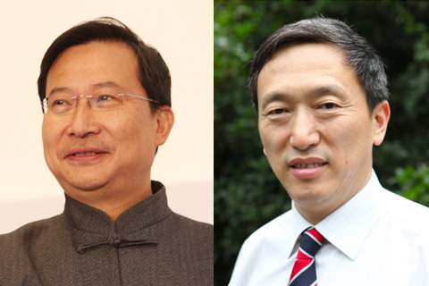

# 饶毅举报引发公开论战 裴钢回应称饶应拿出实质证据 

[饶毅举报引发公开论战 裴钢回应称饶应拿出实质证据 (caixin.com)](http://m.science.caixin.com/m/2021-01-25/101655569.html?cxw=IOS&Sfrom=Wechat&originReferrer=iOSshare)

2021年01月25日 19:55

裴钢1月25日回应财新记者称，饶毅应拿出实质证据。此前饶毅实名向中科院道德建设委员会举报裴钢涉嫌学术不端，引发论战。几日来他数次发文反驳相关当事人，呼吁第三方重复实验

[原图](https://img.caixin.com/2021-01-25/1611577079900156.jpg)资料图： 饶毅、裴钢（左起）

　　**【财新网】（记者 黄晏浩 徐路易）**首都医科大学校长饶毅公开举报中科院院士裴钢涉嫌学术不端一事，随着几个回合的公开论战而受到广泛关注。1月25日，裴钢就此事回应财新记者称，饶毅应拿出实质证据。

　　1月21日晚，饶毅在个人公众号“饶议科学”[发文](http://raoyi.blog.caixin.com/archives/241152)称，已经实名向中科院第六届道德建设委员会发邮件，举报裴钢涉嫌学术不端。随后几天中围绕此事的一场公开论战暴发，饶毅数次发文反驳相关当事人，呼吁有公信力的第三方进行重复实验。1月25日，裴钢以短信形式回复财新记者称，“众所周知科研打假和举报学术不端都应该遵纪守法。举报者举证，作为网络打假和学术不端公开举报人有法理责任和义务提供2019年网络举报时持有的学术造假实证和这次公开实名举报学术不端的实质证据。”

　　何谓实质证据？裴钢回复称，《科研诚信案件调查处理规则（试行）》对“科研失信行为”有明确规定，包括六种行为及其他科研失信行为。其中第二条为“编造研究过程，伪造、篡改研究数据、图表、结论、检测报告或用户使用报告”。财新记者询问，这是否意味着饶毅教授需要拿出能证明“编造研究过程，伪造、篡改研究数据、图表、结论、检测报告或用户使用报告”的证据或线索？裴钢短信回复道，“对！应该是可以在法庭上举证的实质证据”，随后又补充说，“也可以是科技部科研诚信建设联席会议机制经过严肃调查已经认定的证据材料或查证线索，如果有的话。”

　　几天前的1月21日晚，科技部发布《[有关论文涉嫌造假调查处理情况的通报](http://database.caixin.com/2021-01-25/101655609.html)》（下称“《通报》”），公布了此前五位中国学者“涉嫌学术造假”的调查结果。《通报》表示，对网络质疑裴钢院士的1篇论文，经调查未发现有造假；对网络质疑饶毅教授用于自然科学基金项目申请的2篇论文，经调查未发现有造假。（详见财新网报道《[科技部称曹雪涛等论文存图片误用 饶毅再举报裴钢](http://science.caixin.com/2021-01-22/101653982.html)》）

　　《通报》发出两小时后，饶毅在个人公众号上发文表示，已经实名向中科院第六届道德建设委员会发邮件，举报裴钢涉嫌学术不端，所针对是裴钢为通讯作者、1999年发表于《美国科学院院刊》（PNAS）的论文（下称“1999年论文”）。值得一提的是，裴钢本人就是中科院第六届道德建设委员会的主任，该举报信发送给了包括裴钢在内的多人。而早在2019年11月，一封在网上流传、署名饶毅的举报信中已经对“1999年论文”提出过质疑。饶毅曾向媒体表示，该举报信“没有发出，有过草稿”。

　　饶毅在1月21日晚的举报信中称，1999年论文在图3、4、5中显示CXCR4和CCR5两个GPCRs可以只要五重跨膜就能够起功能，“打破全世界的共识，且至今无人重复”。他还指出，裴钢实验室自己也没有发表重复该实验结果的论文。“如果裴钢继续坚持自己实验室的论文没有学术不端，不用听信裴钢或我个人任何一方的意见，按照国际标准，非常简单：重复实验，如果能够验证就可以还裴钢实验室一个清白。”

　　1月22日中午，饶毅在个人公众号[再度发文](http://raoyi.blog.caixin.com/archives/241152)，对前一天举报裴钢的邮件进行补充。他表示，裴钢论文中的实验需要重复，且使用同样变异的基因，“也就是编码的CCR5受体缺乏同样72个氨基酸（从第36位的亮氨酸到107位的甘氨酸）”“用其他的GPCR不能算”。饶毅表示，如果不能重复，裴钢应该致信《美国科学院院刊》提出撤稿。“如果不能重复，是有人造假，还是有无意的失误，需要有专门调查。”

　　此外，饶毅还建议，中科院道德建设会员会应该请裴钢的博士后导师、2012年诺贝尔化学奖得主Robert Leftkowitz主持调查，或者咨询他国际惯例和程序，另一位2012年诺贝尔化学奖得主Brian Kobilka也可以主持、参与或咨询中科院道德建设委员会的调查。

　　1月22日下午，科学网发布题为《[张曙光VS饶毅：关于裴钢被质疑论文的争鸣](http://news.sciencenet.cn/htmlnews/2021/1/452248.shtm)》的专题文章，其中有一份美国麻省理工学院（MIT）分子结构实验室首席研究员张曙光写给饶毅的英文信件的中文版，1999年论文的三位第一作者——梅奥医学中心生化与分子生物学系副教授凌堃、上海科技大学免疫化学研究所研究员赵简和同济大学医学院教授王平提供的和该篇论文相关的综述材料，以及饶毅的上述举报信。

　　张曙光在信中表示，他们团队近几年在MIT的研究成果支持裴钢等人1999年论文的结果。他们于2020年发表的文章表明只有2个或3个跨膜片段的CXCR4和CCR5突变体能够显示出配体结合活性、能够定位到细胞质膜上、并能够进行细胞信号转导。张曙光还引述了其他文献提到有许多类似截短但具有功能正常的受体。

　　1月23日，饶毅在其个人公众号第三次发文《[实验是检验张曙光pk裴钢对错的唯一标准](http://raoyi.blog.caixin.com/archives/241222)》回应张曙光。他表示，张曙光于2020年发表的论文与裴钢的1999年论文结果是“截然相反”的，也就是它正好否定了“1999年论文”的结果。饶毅再次吁请有公信力的第三方来进行重复实验，希望中国科学院道德建设委员会应该严格地按合理程序进行调查。

　　此外，饶毅还对上述张曙光信件的公开方式提出质疑。他表示，在1月22日张曙光给自己发送英文电子邮件后不久，“（中国）科学院主管的新闻网站突然出现张曙光邮件的中文译件，而且同时在同一新闻中刊登了凌堃等相关人的文章。这封信的中文和凌堃等中文文章都没有在其他地方先出现过”。饶毅认为，裴钢不能“公器私用，不能用科学院的资源为他个人服务”。科学网官方介绍显示，该网站由中国科学院、中国工程院、国家自然科学基金委员会和中国科学技术协会主管，由中国科学报社主办。

　　财新记者联系了张曙光和饶毅，截至发稿时未得到回复。据饶毅在23日的文章中称，目前中科院道德建设委员会已接受了他的举报，截至发稿时财新记者未能向该委员会核实是否已受理举报。

　　关于为何举报裴钢，饶毅在上述1月23日的文章中称，“其实每一步我都是被动的。有人向（国家自然科学）基金委举报我，2019年基金委致函我新到的工作单位，蓄意造成不良影响，我不得不回复基金委，在初稿上列举了裴钢。而裴钢在上海法庭起诉我。现在，裴钢又有预谋地协调张曙光公开对我进行人身攻击。我只好公开我的回复。”

　　2019年11月，一封署名为饶毅、落款时间为2019年11月28日的举报信在网上流传。从网传截图可知，饶毅实名向国家自然科学基金委主任李静海举报称，李红良、耿美玉、裴钢存在学术不端行为。信中称，裴钢的“1999年论文”的图3、图4、图5“是不可能真实的，只有造假才能产生。”事后饶毅曾向媒体表示，该举报信“没有发出，有过草稿”。而国家自然科学基金委员会当时也对媒体表示，正在调查核实此事。

　　该举报信中还提到，国家自然科学基金委曾向首都医科大学发函要求调查饶毅，“昨天收到贵委2019年11月22日寄首都医科大学函，称请单位调查所谓我发表的论文涉嫌存在不端行为。”当时，饶毅刚出任首都医科大学校长不足五个月。

　　在此之后，饶毅和裴钢还曾因名誉权纠纷对薄公堂。财新记者从中国裁判文书网找到一份上海市第一中级人民法院2020年7月13日做出的《饶毅与裴钢名誉权纠纷二审案件二审民事裁定书》，其中显示，饶毅因名誉纠纷一案，不服上海市徐汇区人民法院（2020）沪0104民初5322号民事裁定，提起上诉，但最终被驳回，维持原裁定。财新记者就此民事纠纷详情询问裴钢，未获回应。

　　饶毅在上述1月21日的文章中称，“在2020年12月4日法庭上，因为我指出全世界没有任何人能够重复他实验室1999年的结果，裴钢用这篇没有发表的文章作为有人重复了的‘林-裴 （1999）’的证据。”

　　1月24日，事件中的更多当事人发声。当天10时28分，用户名为“kingboxer”的知乎用户在知乎上发贴《[给饶毅教授的回复+补充回复](https://zhuanlan.zhihu.com/p/346566368)》，称自己是上述1999年论文的第一作者凌堃，并贴出该论文三位第一作者凌堃、王平、赵简发给饶毅的邮件截图。邮件中写道，“出于对您多次指控的重视，科技部、中国科学院、中科院上海生化细胞所先后组织了独立的专家组和工作组对此进行了严肃的审查，包括调阅当年的原始实验记录、审查第三方实验室重复的实验结果等等，我们也按照专家们的要求提供了所有支持材料。科技部公布的最后结论也正是基于这些严谨独立的专家组对所有数据的认可。”

　　凌堃等三人还表示，饶毅多次提到其团队无法重复出1999年论文类似的结果，“能否请您安排做这项实验的学生和/或技术员提供具体的实验操作流程记录及相关结果，我们可以帮助具体分析一下，一起来寻找导致实验失败的原因。”“您还提到您了解到还有几个研究组也在研究中遇到问题，请您提供他们的名单和联系方式，我们也会和他们进行直接的讨论。”

　　此外，凌堃等还给出了12篇论文的文献目录，“现将我们提供给专家组的含有第三方实验室重复GPCR截短体仍具有功能实验结果的文献目录附上，也请您尽快提供给我们您了解到的质疑我们这篇论文的含有第三方实验室重复实验结果的文献”。

　　该文发出约8个小时后，1月24日晚6时26分，饶毅在个人公众号第四次发文《[树欲静而风不止，劝裴钢学生凌堃不要帮倒忙](http://raoyi.blog.caixin.com/archives/241264)》，回应凌堃等人。饶毅对上述12篇论文逐篇进行了批驳，“那12篇文章可以分为三类：2篇仍然支持‘凌堃-裴钢的结果不能重复’，其中有文章与凌堃-裴钢结果矛盾；6篇支持‘凌堃-裴钢的结果没有被重复’，4篇支持‘需要通过实验进一步检验凌堃-裴钢的结果能否被重复’。”

　　饶毅同时质疑了上述凌堃等所称的科技部、中国科学院、中科院上海生化细胞所先后组织的“独立的专家组和工作组进行的严肃审查”。他称，中科院上海生化细胞所组织的严肃审查是“不独立于裴钢的、草率从事的、不负责任的、捍卫性质的调查”，并在附件中提供了自己与上海生化与细胞所调查委员会的交流邮件，邮件显示时间为2019年12月14日。

　　饶毅提供的邮件显示，这是一次由上海生化与细胞所组织的针对裴钢的调查。该所于2019年11月29日成立“裴钢研究组1999年PNAS论文调查委员会”，于12月1日出具了五位教授签字的调查报告。饶毅称，他在12月1日上午8点16分第一次回复调查委员会的某个成员，“委员会其他成员给我提了任何问题吗？显然没有。也就是说，‘分子细胞科学卓越创新中心’的调查，正如我所担心的，并非公正的调查：匆匆忙忙，不问我，联系我也是虚伪的，并没有把我提供的信息给委员会。”

　　中科院分子细胞科学卓越创新中心成立于2015年，依托中科院原上海生化与细胞所建设及管理。2019年12月13日，多家媒体报道称，分子细胞科学卓越创新中心表示，针对前期网传“裴钢院士被实名举报论文造假”的信息，该中心已请外部专家进行初步核查，没有发现该论文造假的证据。

　　饶毅称，“我上午刚刚试探性地开始有一点点回话下午就有调查结论不出12小时，从周五收到参与调查的通知到星期天得出调查结论不出48小时，上海生化细胞的速度都接近空前绝后了。”

　　而关于上述中科院和科技部的调查，饶毅称，“如果有您所说的中国科学院负责调查的专家组，也完全没有询问我。科技部的行政与我有交流，但专家组没有。我认为在这次的过程中，做的最好的是教育部、其次是科技部。科技部隔了几层，不容易参与调查。中国科学院生化细胞所做的第二差，药物所做的最差。”

　　针对凌堃等作者提出的问题，饶毅认为，“实验重复”的事情应该由裴钢方回答，自己可以接受第三方重复的结果。“我们都应该接受第三方重复的结果，而您和裴钢没有理由反对第三方重复。例如可以您寄给大家实验材料，大家可以做。我实验室愿意在任何部委监督组监督下，做钙离子是否升高的实验。您实验室也可以做。裴钢也可以。”

　　饶毅1962年生于江西省，于1978-1985年分别在江西医学院（现南昌大学江西医学院）以及上海第一医学院（现复旦大学上海医学院）接受医学教育。他于1985年赴美在旧金山加州大学（UCSF）念研究生，1991年获博士学位；并于1991-1994年在哈佛大学生物化学与分子生物学系做博士后。1994年至2007年，饶毅分别在美国圣路易斯的华盛顿大学和芝加哥的西北大学任教，研究神经发育的分子和细胞机理。2007年，饶毅回到中国并出任北京大学生命科学学院院长至2013年。2019年6月，饶毅任首都医科大学校长。

　　裴钢今年67岁，于1953年12月生于辽宁省。1978年初进入沈阳药科大学学习，1982年获学士学位、1984获硕士学位。1987年进入美国北卡大学学习，1991年获生物化学和生物物理学博士学位。1992年至1995年2月在美国杜克大学进行博士后研究。1995年3月回国，担任德国马普学会和中科院共同支持的青年科学家小组组长及研究员。1999年，裴钢当选中国科学院院士。2000年5月至2007年11月，任中科院上海生命科学研究院院长。2007年8月，裴钢任同济大学校长，并于2016年9月卸任。2019年，他被聘为中国医学科学院学部委员。

责任编辑：冯禹丁
版面编辑：张翔宇